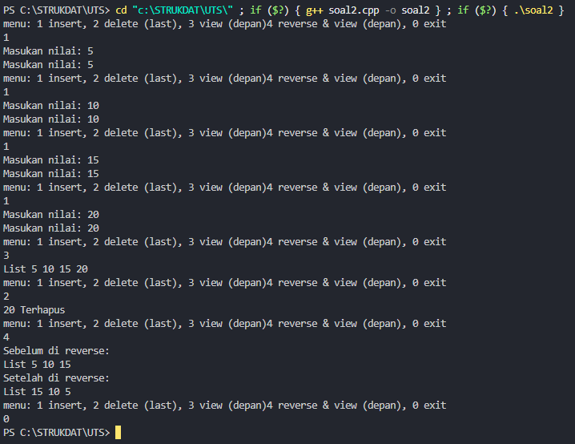

UJIAN TENGAH SEMESTER PRAKTIKUM STRUKTUR DATA CLO 3

Identitas Pengumpul

Nama: Muhammad Haidar Amanullah

NIM: 103112400262

Kelas: IF-12-05

1. Kode Program

Berikut adalah kode program untuk membuat dan mengelola doubly linked list menggunakan C++. Program ini memungkinkan pengguna untuk menambahkan data di akhir list, menghapus data terakhir, menampilkan semua data, dan membalik urutan list

```soal2.cpp
 * Author: Muhammad Haidar Amanullah
 * NIM: 103112400262

#include <iostream>
using namespace std;


struct Node {
    int data;
    Node* prev;
    Node* next;
};

// deklarasi head dan tail
Node* head = nullptr;
Node* tail = nullptr;

// insert nilai di akhir list
void insertAkhir(int value){
    // membuat node baru
    Node* baru = new Node {value, nullptr, nullptr};

    // jika list kosong maka head dan tail menunjuk ke node baru
    if (head == nullptr){
        head = tail = baru;
    }else{ // jika tidak maka tail next menunjuk ke node baru dan prev node baru menunjuk ke tail
        tail->next = baru;
        baru->prev = tail;
        tail = baru;
    }
    cout << "Masukan nilai: " << value << endl;
};

// delete nilai di akhir list
void deleteAkhir(){
    // jika list kosong maka tidak ada yang dihapus
    if (tail == nullptr) return;
    Node* hapus = tail;
    cout << hapus->data << " Terhapus" << endl;

    // jika list hanya memiliki satu node maka head dan tail di set ke nullptr
    if (head == tail){
        head = tail = nullptr;
    }else{ // jika tidak maka tail di geser ke prev dan next di set ke nullptr
        tail = tail->prev;
        tail->next = nullptr;
    }
    delete hapus;
};

// view list dari depan ke belakang
void view(){
    Node* temp = head;
    cout << "List ";

    // ketika temp tidak nullptr maka tampilkan data dan lanjut ke next
    while (temp != nullptr){
        cout << temp->data << " ";
        temp = temp->next;
    }
    cout << endl;
};

// reverse list tanpa membuat node baru
void reverseList(){
    Node* current = head;
    Node* temp = nullptr;

    // ketika current tidak nullptr maka tukar next dan prev
    while (current != nullptr){
        temp = current->prev;
        current->prev = current->next;
        current->next = temp;
        current = current->prev;
    }

    // jika temp tidak nullptr maka head di set ke prev dari temp
    if (temp != nullptr){
        head = temp->prev;
    }
};

int main() {
    // variabel pilihan dan nilai
    int pilihan, nilai;

    // menu pilihan
    do{
        cout << "menu: 1 insert, 2 delete (last), 3 view (depan)" << "4 reverse & view (depan), 0 exit\n";
        cin >> pilihan;

        // proses pilihan
        switch (pilihan){
            // insert nilai di akhir list
            case 1:
            cout << "Masukan nilai: ";
            cin >> nilai;
            insertAkhir(nilai);
            break;

            // delete nilai di akhir list
            case 2:
            deleteAkhir();
            break;

            // view list dari depan ke belakang
            case 3:
            view();
            break;

            // reverse list tanpa membuat node baru
            case 4:
            cout << "Sebelum di reverse: " << endl;
            view();
            reverseList();
            cout << "Setelah di reverse: " << endl;
            view();
            break;

            // exit program
            case 0:
            break;

            default:
            cout << " Pilihan tidak valid\n";
        }
    }while (pilihan != 0);
    return 0;
};
```

2. Penjelasan Kode

Program ini membuat daftar berantai (doubly linked list) yang bisa maju dan mundur. Setiap data disimpan dalam node yang punya nilai, penunjuk ke node sebelumnya, dan penunjuk ke node berikutnya.
Fungsi insertAkhir menambah data di bagian paling belakang. Jika list kosong, data menjadi node pertama dan terakhir. Jika tidak, data ditempel di belakang node terakhir.
Fungsi deleteAkhir menghapus data paling belakang. Jika hanya ada satu data, list menjadi kosong. Jika lebih dari satu, node terakhir dipindah ke node sebelumnya.
Fungsi view menampilkan semua data dari depan ke belakang.
Fungsi reverseList membalik urutan list dengan menukar arah prev dan next di setiap node.
Program utama menampilkan menu untuk memasukkan data, menghapus data, melihat isi list, atau membalik list. Program berhenti jika pengguna memilih exit.

3. Output Program



4. Penjelasan Lanjutan (Analisis Output)

Program ini membuat struktur data doubly linked list. Setiap node menyimpan nilai, alamat node sebelumnya, dan alamat node berikutnya. Head menunjuk ke node pertama, tail menunjuk ke node terakhir.
Fungsi insertAkhir menambahkan node baru di akhir list. Jika list kosong, node menjadi head dan tail. Jika list sudah ada isi, node baru ditempel di belakang tail, kemudian tail diperbarui.
Fungsi deleteAkhir menghapus node terakhir. Jika list kosong, tidak ada yang dihapus. Jika hanya satu node, list menjadi kosong. Jika lebih dari satu, tail dipindah ke node sebelumnya dan node terakhir dihapus.
Fungsi view menampilkan data dari head ke tail dengan menelusuri setiap node menggunakan next.
Fungsi reverseList membalik urutan node dengan menukar prev dan next di setiap node, kemudian head diperbarui ke node terakhir sebelumnya.
Program utama menyediakan menu interaktif untuk menambah data, menghapus data terakhir, melihat list, atau membalik urutan list. Program terus berjalan hingga pengguna memilih keluar.

5. Kesimpulan

Kesimpulan dari program ini adalah doubly linked list memungkinkan penyimpanan data secara berurutan dengan kemampuan menelusuri data dari depan ke belakang maupun sebaliknya. Program ini berhasil melakukan operasi dasar yaitu menambahkan data di akhir list, menghapus data terakhir, menampilkan seluruh data, dan membalik urutan list. Dengan penggunaan node yang saling terhubung melalui prev dan next, operasi pada list menjadi lebih fleksibel dibandingkan array biasa. Program juga menunjukkan cara pengelolaan memori secara dinamis menggunakan pointer sehingga node yang dihapus dapat dibebaskan dengan aman.