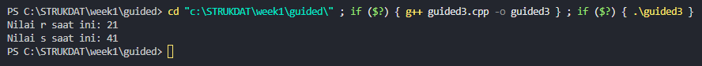

<h1 align = center > <b>  LAPORAN PRATIKUM STUKTUR DATA PERTEMUAN 1 <br>
</b></h1><p align = center><b>Nama : Muhammad Haidar Amanullah || NIM : 103112400262 || Kelas : IF-12-05</b></p>

<h1> 1. Motivasi Belajar Struktur Data </h1>

Menurut saya, belajar struktur data itu semacam pondasi utama buat ngerti cara ngatur dan pake informasi. Kalau udah paham konsep dasarnya, bikin program jadi terasa lebih gampang, lebih rapi, dan pastinya lebih efisien. Dari situ juga, kita bisa lebih siap buat nyelesaikan masalah nyata, misalnya ngolah data di aplikasi, bikin layanan digital yang enak dipakai, atau program kecil-kecilan yang bisa bantu aktivitas sehari-hari jadi lebih simpel.


<h1> 2. Dasar Teori </h1>

C++ adalah bahasa pemrograman yang dikembangkan oleh ilmuwan komputer asal Denmark, Bjarne Stroustrup, di Bell Laboratories pada tahun 1979. Awalnya, bahasa ini disebut "C with Classes" karena dirancang sebagai perluasan dari bahasa C dengan menambahkan fitur pemrograman berorientasi objek (OOP), seperti kelas dan pewarisan, untuk mendukung pengembangan perangkat lunak yang lebih terstruktur dan efisien. Pada tahun 1983, nama bahasa ini diubah menjadi C++

C++ digolongkan sebagai bahasa pemrograman tingkat menengah (middle-level language). Ini berarti C++ menggabungkan fitur dari bahasa tingkat tinggi dan rendah. Dari sisi tingkat rendah, C++ memungkinkan manipulasi memori secara langsung dan kontrol atas hardware, mirip dengan bahasa C. Sementara dari sisi tingkat tinggi, C++ mendukung konsep-konsep OOP yang memudahkan pengembangan perangkat lunak yang kompleks

Keunggulan C++
1. Efisiensi dan Performa Tinggi: C++ dirancang untuk aplikasi yang memerlukan kinerja tinggi, seperti game dan sistem operasi.
2. Fleksibilitas: Mendukung berbagai paradigma pemrograman, termasuk prosedural, berorientasi objek, dan generik.
3. Kontrol Memori: Memberikan kontrol langsung atas penggunaan memori, memungkinkan pengembangan aplikasi yang efisien.
4. Portabilitas: Banyak digunakan di berbagai platform dan industri teknologi

Sejarah Singkat C++
1979: Bjarne Stroustrup mulai mengembangkan "C with Classes" di Bell Laboratories.
1983: Nama bahasa diubah menjadi C++.
1985: Versi pertama C++ dirilis secara umum.
1986: Buku "The C++ Programming Language" diterbitkan oleh Stroustrup sebagai referensi resmi

<h1> 3. Guided </h1>

### 3.1 Guided 1 (Discount)

**-Code Program-**

```cpp
#include<iostream>

using namespace std;

int main() {
    double total_pembelian, diskon; // Deklarasi variabel total_pembelian dan diskon
    cout << "Berapa kamu belanja: Rp.";
    cin >> total_pembelian; // Input total pembelian
    if(total_pembelian >= 30000) {
        diskon = 0.1 * total_pembelian; // Hitung diskon 10%
        cout << "Kamu dapat diskon sebesar " << diskon << " orang kaya lu bocah";
    } else {
        cout << "Kamu belanjanya masih dikit, Tambahin lah,biar gua kaya";
    }
}
```
**-Penjelasan Umum-**

Program di atas merupakan contoh sederhana penggunaan bahasa pemrograman C++ untuk kasus nyata: menghitung diskon pembelian di sebuah toko. Program ini memperlihatkan beberapa konsep dasar C++ seperti deklarasi variabel, input/output, dan struktur percabangan (if-else).

**-Output-**


### 3.2 Guided 2 (Increment)

**-Code Program-**

```cpp
#include<iostream>

using namespace std;

int main(){
    float celcius, fahrenheit; // Deklarasi variabel celcius dan fahrenheit

    cout << "Seberapa dingin lu:";
    cin >> celcius;                 // Input suhu dalam celcius

    fahrenheit = (9.0/5.0) * celcius + 32;  // Konversi ke fahrenheit

    cout << "Dingin lu itu setara sama suhu: " << fahrenheit << "derajat fahrenheit" <<endl;
    cout << "Itu dingin banget bjrr";

    return 0;   
}
```
**-Penjelasan Umum-**

Program di atas adalah contoh sederhana penggunaan bahasa pemrograman C++ untuk mengonversi suhu dari Celcius ke Fahrenheit. Program ini memperlihatkan konsep dasar C++ seperti deklarasi variabel, input/output, dan operasi aritmatika.

**-Output-**


### 3.3 Guided 3 (Konversi suhu)

**-Code Program-**

```cpp
#include<iostream>    

using namespace std;       

int main() {
    int r = 20;             // Inisialisasi variabel r dengan nilai 20
    int s;                  // Deklarasi variabel s (belum ada nilai)

    s = 20 + ++r;           // Pre-increment: r = 21 dulu, lalu s = 20 + 21 = 41
    cout << "Nilai r saat ini: " << r << endl;  // Menampilkan r = 21
    cout << "Nilai s saat ini: " << s << endl;  // Menampilkan s = 41

    return 0;               
}

```
**-Penjelasan Umum-**

Program di atas adalah contoh sederhana penggunaan operator pre-increment (++r) dalam bahasa C++. Program ini memperlihatkan bagaimana operasi aritmatika dan increment bekerja dalam C++, serta bagaimana hasilnya bisa langsung ditampilkan ke layar.

**-Output-**




<h1> 4. Unguided </h1>

### 4.1 Unguided 1

**-Soal 1-**

Buatlah program yang menerima input-an dua buah bilangan bertipe float, kemudian memberikan output-an hasil penjumlahan, pengurangan, perkalian, dan pembagian dari dua bilangan tersebut

**-Code Program-**

```cpp
#include <iostream>

using namespace std;

int main() {
    float angka1, angka2; // Deklarasi variabel bilangan pertama & kedua
    cout << "Masukkan bilangan pertama: ";
    cin >> angka1;
    cout << "Masukkan bilangan kedua: ";
    cin >> angka2;

    cout << "Penjumlahan: " << angka1 + angka2 << endl; //operasi penjumlahan
    cout << "Pengurangan: " << angka1 - angka2 << endl; //operasi pengurangan
    cout << "Perkalian: " << angka1 * angka2 << endl; //operasi perkalian
    if (angka2 != 0)    // Cek pembagian dengan nol
        cout << "Pembagian: " << angka1 / angka2 << endl;   //operasi pembagian
    else
        cout << "Pembagian: Tidak bisa dibagi 0!" << endl;  // Pesan error pembagian dengan nol

    return 0;
}

```
**-Penjelasan Umum-**

Program ini merupakan contoh sederhana penggunaan bahasa pemrograman C++ untuk melakukan operasi aritmatika dasar (penjumlahan, pengurangan, perkalian, dan pembagian) antara dua bilangan. Program ini memperlihatkan beberapa konsep fundamental C++, seperti deklarasi variabel, input/output, operator aritmatika, dan percabangan.

**-Output-**


### 4.2 Unguided 2

**-Soal 2-**

**-Code Program-**

Buatlah sebuah program yang menerima masukan angka dan mengeluarkan output nilai angka tersebut dalam bentuk tulisan. Angka yang akan di-input-kan user adalah bilangan bulat positif mulai dari 0 s.d 100.

```cpp
#include <iostream>

using namespace std;

string satuan[] = {"nol","satu","dua","tiga","empat","lima","enam","tujuh","delapan","sembilan"};  // Indeks 0-9    
string belasan[] = {"sepuluh","sebelas","dua belas","tiga belas","empat belas","lima belas","enam belas","tujuh belas","delapan belas","sembilan belas"};   // Indeks 10-19 
string puluhan[] = {"","sepuluh","dua puluh","tiga puluh","empat puluh","lima puluh","enam puluh","tujuh puluh","delapan puluh","sembilan puluh"};  // Indeks (20,30,...,90)

string terbilang(int a) {     // Fungsi untuk mengubah angka menjadi kata
    if (a < 10) return satuan[a];   // Jika a < 10, langsung ambil dari array satuan               
    else 
    if (a < 20) return belasan[a - 10]; // Jika a < 20, ambil dari array belasan dengan indeks (a-10)
    else 
    if (a < 100) {  // Jika a < 100, pecah menjadi puluhan dan satuan      
        int p = a / 10; // Puluhan
        int s = a % 10; // Satuan
        if (s == 0) return puluhan[p]; // Jika satuan 0, hanya puluhan
        else return puluhan[p] + " " + satuan[s]; // Gabungkan puluhan dan satuan
    } else      
    if (a == 100) return "seratus"; // Jika a = 100
    else
    return "di luar jangkauan"; // Jika a > 100
}

int main() {
    int a; // Deklarasi variabel a
    cout << "Masukkan angka (0-100): "; 
    cin >> a;   // Input angka
    cout << a << " : " << terbilang(a) << endl; // Tampilkan hasil konversi
    return 0;
}

```
**-Penjelasan Umum-**

Program ini merupakan contoh penggunaan fungsi, array, dan percabangan dalam bahasa C++ untuk mengubah angka menjadi bentuk tulisan (terbilang). Program ini dapat menerima angka bulat positif dari 0 hingga 100 dan menampilkan hasil konversi ke layar.

**-Output-**


### 4.3 Unguided 3

**-Soal 3-**

Buatlah program yang dapat memberikan input dan output sbb.

**-Code Program-**

```cpp
#include <iostream>
using namespace std;
int main () {
    int a;
    cout << "Masukkan tinggi segitiga: ";
    cin >> a;
    for (int i = 0; i <= a; i++) { // untuk mengatur baris
        for (int j = 0; j <= a*2; j++){ // untuk mengatur kolom
            if (a - j == 0) { // tengah segitiga
                cout << "* "; // tanda bintang
                for (int k = 0; k < j; k++) {  // untuk segitiga sebelah kanan tanda bintang
                    if (k+1 <= a-i) {   // untuk membatasi pencetakan angka setiap barisnya
                        cout << k + 1 << " ";
                    }
                }
            } else if (j <= a) { // untuk segitiga sebelah kiri tanda bintang
                if (j+1 <= i) {  // untuk membatasi pencetakan angka setiap barisnya
                    cout << "  ";
                } else { // untuk mencetak angka
                    cout << a-j << " ";
                }
            }
        }
        cout << endl;
    }
    
}
```
**-Penjelasan Umum-**

Program ini adalah contoh penerapan looping bersarang (nested loop) dan percabangan (if-else) dalam bahasa C++ untuk mencetak pola segitiga angka dengan tanda bintang sebagai titik tengah. Program menerima input tinggi segitiga dari pengguna dan menghasilkan pola sesuai ukuran yang dimasukkan.

**-Output-**


<h1> 5. Kesimpulan </h1>
Dari praktikum ini dapat disimpulkan bahwa tujuan praktikum telah tercapai, yaitu memahami penerapan konsep dasar pemrograman C++ seperti penggunaan variabel, operator aritmatika, percabangan, perulangan, dan array string dalam menyelesaikan permasalahan sederhana. Implementasi teori yang dipelajari dapat terlihat dari pembuatan program-program praktis seperti konversi suhu dari Celcius ke Fahrenheit, operasi aritmatika dasar, pola segitiga angka, konversi angka ke tulisan (terbilang), diskon pembelian, dan operator pre-increment. Melalui praktikum ini, pemahaman terhadap teori menjadi lebih jelas karena dapat mengulang membuat program lagi walaupun menggunakan bahasa C++, yang bukan bahasa pemrograman yang biasanya digunakan. Praktikum ini juga menambah wawasan baru, terutama mengenai struktur data dan logika pemrograman dasar yang berlaku luas dalam berbagai bahasa.

<h1> 6. Referensi </h1>

1. https://en.wikipedia.org/wiki/C%2B%2B

2. https://www.stroustrup.com/crc.pdf
   
3. https://www.hostinger.com/id/tutorial/bahasa-pemrograman-cpp