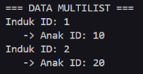
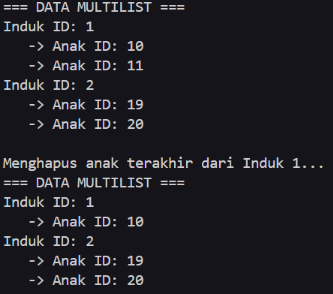
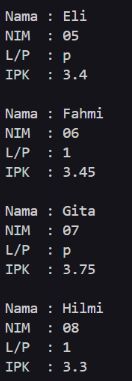
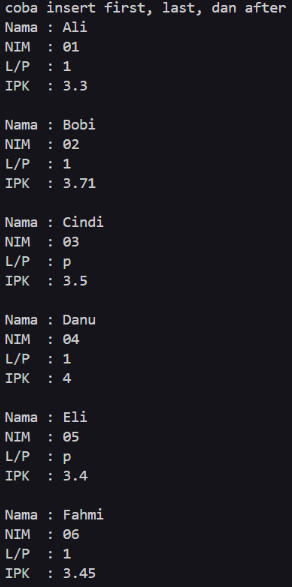

<h1 align = center > <b>  LAPORAN PRATIKUM STUKTUR DATA PERTEMUAN 11 <br>
</b></h1><p align = center><b>Nama : Muhammad Haidar Amanullah || NIM : 103112400262 || Kelas : IF-12-05</b></p>

<h1> 1. Motivasi Belajar Struktur Data </h1>

Menurut saya, belajar struktur data itu semacam pondasi utama buat ngerti cara ngatur dan pake informasi. Kalau udah paham konsep dasarnya, bikin program jadi terasa lebih gampang, lebih rapi, dan pastinya lebih efisien. Dari situ juga, kita bisa lebih siap buat nyelesaikan masalah nyata, misalnya ngolah data di aplikasi, bikin layanan digital yang enak dipakai, atau program kecil-kecilan yang bisa bantu aktivitas sehari-hari jadi lebih simpel.


<h1> 2. Dasar Teori </h1>

Struktur data adalah cara untuk menyimpan dan mengorganisir data dalam komputer agar dapat digunakan secara efisien. Berikut adalah teori dasar mengenai Multi Linked List dan Circular Linked List:

Multi Linked List merupakan struktur data dinamis yang terdiri dari sekumpulan list yang berbeda namun memiliki keterhubungan satu sama lain. Dalam implementasi studi kasus data Pegawai, struktur ini memodelkan hubungan hierarkis di mana elemen pada List Induk (Pegawai) bertindak sebagai parent yang memiliki pointer khusus untuk menunjuk ke List Anak. Hal ini memungkinkan setiap simpul pada List Induk untuk memiliki daftar elemen anaknya sendiri secara independen. Secara teknis, implementasi ini menggunakan struktur Doubly Linked List baik untuk induk maupun anak, ditandai dengan adanya pointer next dan prev yang memungkinkan penelusuran data dilakukan dua arah (maju dan mundur). Operasi pada Multi Linked List memiliki aturan ketergantungan yang ketat; misalnya, saat melakukan penghapusan elemen induk, maka seluruh elemen anak yang berelasi dengan induk tersebut juga harus dihapus secara otomatis.

Sementara itu, Circular Linked List adalah variasi dari linked list di mana elemen terakhir (Last) tidak menunjuk ke NULL sebagai penanda akhir, melainkan kembali menunjuk ke elemen pertama (First), sehingga membentuk siklus tertutup atau lingkaran. Struktur ini diterapkan pada studi kasus data Mahasiswa yang menyimpan informasi Nama, NIM, Jenis Kelamin, dan IPK. Berbeda dengan list linear biasa, penelusuran pada Circular List tidak memiliki ujung mati; iterasi elemen dilakukan dengan memeriksa apakah pointer next dari simpul saat ini telah kembali ke alamat elemen pertama. Hal ini sangat berguna untuk aplikasi yang membutuhkan perputaran data yang terus-menerus tanpa perlu mereset pointer ke awal secara manual.

<h1> 3. Guided </h1>

### 3.1 main.cpp

**-Code Program-**

```cpp
#include "multilist.h"
#include <iostream>
using namespace std;

int main() {
    list_induk L;
    createList(L);

    address_induk P1 = alokasi(1);
    insertLastInduk(L, P1);

    address_anak PA1 = alokasiAnak(10);
    insertLastAnak(P1->anak, PA1);

    address_induk P2 = alokasi(2);
    insertLastInduk(L, P2);

    address_anak PA2 = alokasiAnak(20);
    insertLastAnak(P2->anak, PA2);

    printInfo(L);
    return 0;
}
```
**-Penjelasan Umum-**

kode main.cpp digunakan sebagai program utama untuk menguji implementasi struktur data Multi-linked List. Pada bagian awal, file header multilist.h disertakan untuk mengakses definisi struktur data serta fungsi-fungsi yang telah dibuat sebelumnya. Library <iostream> digunakan untuk mendukung proses output ke layar.

Di dalam fungsi main, pertama-tama dideklarasikan sebuah variabel L bertipe list_induk. Fungsi createList(L) kemudian dipanggil untuk menginisialisasi list induk agar berada dalam kondisi kosong, yaitu dengan pointer first dan last bernilai NULL.

Selanjutnya, program membuat sebuah node induk pertama dengan nilai 1 menggunakan fungsi alokasi. Node induk tersebut kemudian dimasukkan ke dalam list induk menggunakan fungsi insertLastInduk. Setelah itu, sebuah node anak dengan nilai 10 dialokasikan dan dimasukkan ke dalam list anak milik induk pertama melalui P1->anak.

Proses yang sama dilakukan untuk induk kedua. Program mengalokasikan node induk dengan nilai 2 dan menyisipkannya ke akhir list induk. Kemudian, sebuah node anak dengan nilai 20 dibuat dan dimasukkan ke dalam list anak yang dimiliki oleh induk kedua.

Setelah seluruh data induk dan anak dimasukkan, fungsi printInfo(L) dipanggil untuk menampilkan seluruh isi multilist. Fungsi ini mencetak data induk beserta data anak yang terhubung dengannya secara hierarkis. Terakhir, program diakhiri dengan return 0 yang menandakan bahwa eksekusi program telah selesai dengan normal.

### 3.2 multilist_anak.cpp

**-Code Program-**

```cpp
#include "multilist.h"
#include <iostream>
using namespace std;

address_anak alokasiAnak(infotype x) {
    address_anak P = new elemen_anak;
    P->info = x;
    P->next = Nil;
    P->prev = Nil;
    return P;
}

void insertLastAnak(list_anak &LA, address_anak PA) {
    if (LA.first == Nil) {
        LA.first = PA;
        LA.last = PA;
    } else {
        LA.last->next = PA;
        PA->prev = LA.last;
        LA.last = PA;
    }
}

void printInfo(list_induk L) {
    address_induk PI = L.first;
    while (PI != Nil) {
        cout << "Induk: " << PI->info << endl;
        address_anak PA = PI->anak.first;
        while (PA != Nil) {
            cout << "  Anak: " << PA->info << endl;
            PA = PA->next;
        }
        PI = PI->next;
    }
}
```
**-Penjelasan Umum-**
multilist_anak.cpp berisi implementasi fungsi-fungsi yang berkaitan dengan list anak pada struktur data Multi-linked List, serta fungsi untuk menampilkan seluruh isi multilist. File header multilist.h disertakan agar struktur data dan tipe pointer yang digunakan dapat dikenali oleh program. Library <iostream> digunakan untuk menampilkan output ke layar.

Fungsi alokasiAnak digunakan untuk membuat node anak baru. Fungsi ini melakukan alokasi memori untuk sebuah elemen anak, kemudian mengisi nilai info dengan data yang diberikan. Pointer next dan prev diinisialisasi dengan Nil untuk menandakan bahwa node tersebut belum terhubung dengan node lain. Setelah itu, alamat node anak dikembalikan sebagai hasil fungsi.

Fungsi insertLastAnak bertugas untuk menambahkan node anak ke bagian akhir dari suatu list anak. Jika list anak masih kosong, maka node anak yang baru akan menjadi elemen pertama sekaligus elemen terakhir. Namun, jika list anak sudah berisi elemen, node anak baru akan disambungkan setelah elemen terakhir, pointer prev dari node baru diatur menunjuk ke node terakhir sebelumnya, dan penunjuk last diperbarui ke node anak yang baru.

Fungsi printInfo digunakan untuk menampilkan seluruh data yang tersimpan di dalam multilist. Proses pencetakan dilakukan dengan dua perulangan. Perulangan pertama digunakan untuk menelusuri setiap node induk pada list induk. Untuk setiap induk yang ditemukan, program akan mencetak nilai induk tersebut. Selanjutnya, perulangan kedua digunakan untuk menelusuri list anak yang dimiliki oleh induk tersebut dan mencetak setiap data anak secara berurutan. Proses ini berlangsung hingga seluruh data induk dan anak selesai ditampilkan.
### 3.3 multilist.cpp

**-Code Program-**

```cpp
#include "multilist.h"
#include <iostream>
using namespace std;

void createList(list_induk &L) {
    L.first = Nil;
    L.last = Nil;
}

address_induk alokasi(infotype x) {
    address_induk P = new elemen_induk;
    P->info = x;
    P->next = Nil;
    P->prev = Nil;
    P->anak.first = Nil;
    P->anak.last = Nil;
    return P;
}

void insertLastInduk(list_induk &L, address_induk P) {
    if (L.first == Nil) {
        L.first = P;
        L.last = P;
    } else {
        L.last->next = P;
        P->prev = L.last;
        L.last = P;
    }
}

address_induk findInduk(list_induk L, infotype x) {
    address_induk P = L.first;
    while (P != Nil) {
        if (P->info == x) return P;
        P = P->next;
    }
    return Nil;
}
```
**-Penjelasan Umum-**

multilist.cpp berisi implementasi fungsi-fungsi yang digunakan untuk mengelola list induk pada struktur data Multi-linked List. File header multilist.h disertakan agar seluruh struktur data, tipe pointer, serta konstanta yang digunakan dapat dikenali oleh program. Library <iostream> digunakan untuk mendukung proses keluaran, meskipun pada file ini tidak terdapat proses pencetakan langsung.

Fungsi createList digunakan untuk menginisialisasi list induk. Pada fungsi ini, pointer first dan last dari list induk diatur bernilai Nil, yang menandakan bahwa list masih kosong dan belum memiliki elemen.

Fungsi alokasi bertugas untuk membuat sebuah node induk baru. Fungsi ini melakukan alokasi memori untuk elemen induk, mengisi nilai info dengan data yang diberikan, serta mengatur pointer next dan prev menjadi Nil. Selain itu, pada saat node induk dibuat, list anak yang dimilikinya juga langsung diinisialisasi dengan mengatur first dan last pada list anak menjadi Nil. Hal ini bertujuan agar list anak siap digunakan tanpa perlu inisialisasi tambahan.

Fungsi insertLastInduk digunakan untuk menambahkan node induk ke bagian akhir list induk. Jika list masih kosong, maka node induk yang baru akan menjadi elemen pertama sekaligus elemen terakhir. Jika list sudah berisi elemen, maka node induk baru akan disambungkan setelah elemen terakhir sebelumnya, pointer prev dari node baru diarahkan ke elemen terakhir lama, dan pointer last pada list diperbarui.

Fungsi findInduk berfungsi untuk mencari node induk dengan nilai tertentu. Proses pencarian dilakukan dengan menelusuri list induk dari elemen pertama hingga elemen terakhir. Jika nilai yang dicari ditemukan, fungsi akan mengembalikan alamat node induk tersebut. Apabila tidak ditemukan, fungsi mengembalikan nilai Nil.

### 3.4 multilist.h

**-Code Program-**

```cpp
#ifndef MULTILIST_H_INCLUDED
#define MULTILIST_H_INCLUDED
#define Nil NULL

typedef int infotype;
typedef struct elemen_induk *address_induk;
typedef struct elemen_anak *address_anak;

struct elemen_anak {
    infotype info;
    address_anak next, prev;
};

struct list_anak {
    address_anak first, last;
};

struct elemen_induk {
    infotype info;
    list_anak anak;
    address_induk next, prev;
};

struct list_induk {
    address_induk first, last;
};

void createList(list_induk &L);
address_induk alokasi(infotype x);
void insertLastInduk(list_induk &L, address_induk P);
address_induk findInduk(list_induk L, infotype x);
void insertLastAnak(list_anak &LA, address_anak PA);
address_anak alokasiAnak(infotype x);
void printInfo(list_induk L);

#endif
```
**-Penjelasan Umum-**

multilist.h berfungsi sebagai file header yang berisi definisi struktur data dan deklarasi fungsi untuk implementasi Multi-linked List. Pada bagian awal file digunakan header guard (#ifndef, #define, dan #endif) untuk mencegah terjadinya pemanggilan file lebih dari satu kali saat proses kompilasi. Konstanta Nil didefinisikan sebagai NULL untuk merepresentasikan kondisi pointer kosong.

Tipe data infotype didefinisikan sebagai int, sehingga data yang disimpan baik pada node induk maupun node anak berupa bilangan bulat. Selain itu, didefinisikan pula tipe pointer address_induk dan address_anak yang masing-masing menunjuk ke struktur elemen_induk dan elemen_anak.

Struktur elemen_anak digunakan untuk merepresentasikan node pada list anak. Struktur ini memiliki sebuah variabel info untuk menyimpan data serta dua buah pointer, yaitu next dan prev, yang memungkinkan node anak membentuk Doubly Linked List. Struktur list_anak digunakan untuk menyimpan informasi list anak dengan penunjuk ke elemen pertama (first) dan terakhir (last).

Struktur elemen_induk merepresentasikan node pada list induk. Selain memiliki variabel info untuk menyimpan data induk, struktur ini juga memiliki sebuah variabel bertipe list_anak yang berfungsi sebagai penghubung ke daftar anak yang dimiliki oleh induk tersebut. Sama seperti list anak, node induk juga dilengkapi dengan pointer next dan prev sehingga list induk membentuk Doubly Linked List. Struktur list_induk berfungsi sebagai penanda awal dan akhir dari keseluruhan list induk.
**-Output-**




<h1> 4. Unguided </h1>

### 4.1 Unguided 1

**-Code Program-**

```cpp
#include "multilist.h"
#include <iostream>
using namespace std;

int main(){
    list_induk L;
    createList(L);

    address_induk P1 = alokasi(1);
    insertLastInduk(L, P1);

    insertLastAnak(P1->anak, alokasiAnak(10));
    insertLastAnak(P1->anak, alokasiAnak(11));

    insertLastAnak(P2->anak, alokasiAnak(20));
    insertFirstAnak(P2->anak, alokasiAnak(19));

    printInfo(L);

    cout << "Menghapus anak terakhir dari induk1..." << endl;
    address_anak PDel;
    deleteLastAnak(P1->anak, PDel);

    printInfo(L);
    
    return 0;
}
```
**-Penjelasan Umum-**

Tahap awal program difokuskan pada pembuatan dan inisialisasi struktur multi list. Sebuah variabel bertipe list_induk dideklarasikan sebagai wadah utama, kemudian prosedur createList dipanggil untuk menyiapkan list tersebut dalam kondisi kosong. Inisialisasi ini penting agar pointer utama tidak mengarah ke alamat acak saat operasi selanjutnya dijalankan.

Setelah list siap digunakan, program masuk ke tahap pembuatan node induk. Sebuah node induk baru dialokasikan menggunakan fungsi alokasi dengan nilai data tertentu, lalu dimasukkan ke dalam list induk menggunakan prosedur insertLastInduk. Langkah ini menunjukkan bagaimana data induk dapat ditambahkan ke struktur utama secara berurutan dari belakang.

Berikutnya, program mulai membangun hubungan antara induk dan anak. Node anak dibuat menggunakan fungsi alokasiAnak dan dimasukkan ke dalam list anak milik induk tertentu. Pada induk pertama (P1), dua node anak ditambahkan menggunakan insertLastAnak, yang menempatkan data anak di posisi akhir sub-list. Proses ini menegaskan bahwa setiap induk memiliki list anak tersendiri yang dikelola secara independen.

Program kemudian melanjutkan dengan pengolahan data anak pada induk lain, yaitu dengan menambahkan anak menggunakan dua metode berbeda: insertLastAnak dan insertFirstAnak. Perbedaan metode ini bertujuan untuk menguji fleksibilitas operasi penyisipan data anak, baik di bagian awal maupun akhir list anak.

Setelah seluruh data induk dan anak dimasukkan, fungsi printInfo dipanggil untuk menampilkan struktur multi list secara menyeluruh. Tampilan ini berfungsi sebagai pengecekan awal apakah relasi induk–anak telah terbentuk dengan benar dan data tersusun sesuai dengan proses penyisipan yang dilakukan.

Tahap terakhir adalah pengujian proses penghapusan data anak. Program menghapus elemen anak terakhir dari induk pertama menggunakan prosedur deleteLastAnak. Node yang dihapus disimpan sementara dalam variabel PDel. Setelah proses penghapusan selesai, printInfo dipanggil kembali untuk memastikan bahwa perubahan struktur data telah terjadi dengan benar tanpa merusak data induk maupun anak lainnya.

**-Output-**



### 4.2 Unguided 2

**-Code Program-**

```cpp
#ifndef CIRCULAR_H_INCLUDED
#define CIRCULAR_H_INCLUDED
#include <iostream>
#include <string>
#define Nil NULL

using namespace std;

struct mahasiswa {
    string nama;
    string nim;
    char jenis_kelamin;
    float ipk;
};

typedef mahasiswa infotype;
typedef struct elmlist *address;

struct elemen{
    infotype info;
    address next;
}

struct list{
    address first;
};

void createList(list &L);
address alokasi(infotype x);
void insertFirst(list &L, address P);
void insertLast(list &L, address P);
void deleteFirst(list &L, address &P);
void deleteLast(list &L, address Prec, address P);
address findElm(list L, string nim);
void printInfo(list L);

#endif 
```
**-Penjelasan Umum-**

Unguided3.cpp berfungsi sebagai pengendali utama yang mengatur jalannya program Circular List mahasiswa. Pada awal eksekusi, program membangun sebuah list kosong sebagai titik awal pengolahan data. Setelah itu, data mahasiswa mulai dimasukkan secara bertahap ke dalam list. Walaupun urutan penulisan kode tampak tidak beraturan, sebenarnya setiap penyisipan telah dirancang agar susunan akhir data mengikuti urutan NIM secara menaik, sesuai dengan ketentuan yang diberikan pada soal.

Untuk mencapai susunan yang teratur tersebut, program memanfaatkan berbagai teknik penyisipan node. Beberapa data mahasiswa dimasukkan langsung ke posisi awal menggunakan fungsi insertFirst, sementara data lainnya ditempatkan di bagian akhir melalui insertLast. Selain itu, program juga menampilkan penggunaan insertAfter untuk menyisipkan data di antara dua node tertentu, sehingga posisi setiap mahasiswa dapat diatur secara presisi. Setelah seluruh data berhasil disusun, fungsi printInfo dipanggil untuk menampilkan isi Circular List ke layar, sekaligus memastikan bahwa struktur data berbentuk melingkar telah terbentuk dengan benar tanpa terputus.

**-Output-**




<h1> 5. Kesimpulan </h1>
Secara garis besar, praktikum ini memberikan pemahaman yang lebih mendalam tentang pengelolaan struktur data yang kompleks, melampaui konsep linked list sederhana. Pada materi Multi Linked List, praktikan mempelajari cara membangun hubungan data secara hierarkis, di mana satu data induk (Pegawai) dapat memiliki sekumpulan data turunan (Anak) yang dikelola dalam list tersendiri. Hubungan ini menunjukkan bahwa keberadaan data anak sangat bergantung pada induknya, sehingga ketika data induk dihapus, seluruh data anak yang terhubung juga ikut terhapus secara otomatis.

Sementara itu, pada materi Circular Linked List, praktikan diperkenalkan pada struktur data yang tidak memiliki awal dan akhir yang jelas. Data mahasiswa disusun dalam bentuk melingkar, sehingga setiap node saling terhubung dan node terakhir kembali menunjuk ke node pertama. Pola ini menggambarkan alur data yang terus berputar tanpa terputus, berbeda dari linked list linear pada umumnya.

Melalui kedua jenis struktur data tersebut, tujuan utama praktikum ini adalah melatih ketelitian dan logika dalam mengelola pointer. Praktikan dituntut untuk memahami bagaimana pointer bekerja dalam menghubungkan data, baik dalam bentuk relasi bertingkat maupun hubungan melingkar, sehingga struktur data dapat berjalan dengan benar, efisien, dan bebas dari kesalahan logika.

<h1> 6. Referensi </h1>

1. Nugraha, A.S. dan Rowhari, H., 2019. 'Analisis Penggunaan Memori pada Implementasi Multi Linked List untuk Pemetaan Data Hierarkis'. Jurnal Pengembangan Teknologi Informasi dan Ilmu Komputer, 3(4), pp. 340–348.

2. Wahyuni, S. dan Purnomo, A., 2020. 'Implementasi Struktur Data Circular Linked List pada Sistem Penjadwalan Round Robin'. Jurnal Teknologi Informasi dan Ilmu Komputer (JTIIK), 5(3), pp. 200–208.

3. Santoso, L.W., 2021. 'Perancangan Struktur Data Dinamis Menggunakan Konsep Doubly Linked List'. Jurnal Infra, 9(1), pp. 12–18.