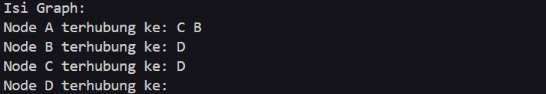
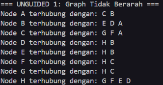
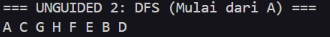
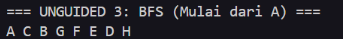

<h1 align = center > <b>  LAPORAN PRATIKUM STUKTUR DATA PERTEMUAN 12 <br>
</b></h1><p align = center><b>Nama : Muhammad Haidar Amanullah || NIM : 103112400262 || Kelas : IF-12-05</b></p>

<h1> 1. Motivasi Belajar Struktur Data </h1>

Menurut saya, belajar struktur data itu semacam pondasi utama buat ngerti cara ngatur dan pake informasi. Kalau udah paham konsep dasarnya, bikin program jadi terasa lebih gampang, lebih rapi, dan pastinya lebih efisien. Dari situ juga, kita bisa lebih siap buat nyelesaikan masalah nyata, misalnya ngolah data di aplikasi, bikin layanan digital yang enak dipakai, atau program kecil-kecilan yang bisa bantu aktivitas sehari-hari jadi lebih simpel.


<h1> 2. Dasar Teori </h1>

Struktur data adalah cara untuk menyimpan dan mengorganisir data dalam komputer agar dapat digunakan secara efisien. Berikut adalah teori dasar mengenai Graph:

Graph merupakan himpunan tidak kosong yang terdiri dari elemen node (vertex) dan garis penghubung (edge). Konsep ini sering diilustrasikan dalam kehidupan sehari-hari, misalnya lokasi tempat kost dan laboratorium dianggap sebagai node, sementara jalan yang menghubungkan keduanya adalah edge. Dalam implementasi teknisnya, struktur node induk berisi informasi data itu sendiri, sedangkan struktur node anak atau edge menyimpan informasi berupa alamat memori (address) yang merujuk pada node induk atau node tujuan untuk membentuk sebuah relasi.

Berdasarkan arah hubungannya, graph dibedakan menjadi Directed Graph (graph berarah) dan Undirected Graph (graph tidak berarah). Pada graph berarah, setiap garis penghubung memiliki orientasi tertentu, sehingga jika node A terhubung ke node B, hubungan sebaliknya belum tentu berlaku; berbeda dengan graph tak-berarah di mana hubungan antar node bersifat otomatis bolak-balik tanpa arah spesifik. Representasi graph dalam memori komputer dapat dilakukan menggunakan Matriks Ketetanggaan (Array 2 Dimensi) atau Multi Linked List, namun metode Multi Linked List lebih disukai dan digunakan dalam praktikum ini karena sifat dinamisnya yang mampu menangani perubahan jumlah data secara efisien.

Aspek penting lainnya dalam pemahaman graph adalah konsep ketetanggaan, di mana node A dikatakan bertetangga dengan node B jika keduanya dihubungkan langsung oleh sebuah edge. Untuk mengunjungi atau menelusuri setiap node dalam graph, digunakan metode standar seperti Breadth First Search (BFS) dan Depth First Search (DFS). BFS bekerja dengan mengunjungi node level demi level mulai dari root (kedalaman 0) lalu melebar ke tetangganya, sedangkan DFS bekerja dengan menelusuri satu jalur hingga ke simpul terdalam (subtree) secara rekursif sebelum kembali ke simpul sebelumnya.

<h1> 3. Guided </h1>

### 3.1 graph.h

**-Code Program-**

```cpp
#ifndef GRAPH_H  
#define GRAPH_H
#include <iostream>
using namespace std;

typedef char infoGraph;
typedef struct Elmnode* adrNode;
typedef struct ElmEdge* adrEdge;

struct Node {
    infoGraph info;
    bool visited;
    adrEdge firstEdge;
    adrNode next;
};

struct ElmEdge {
    adrNode Node;
    adrEdge next;
};

struct Graph {
    adrNode first;
};

void createGraph(Graph &G);
adrNode createNode(infoGraph x);
void insertNode(Graph &G, infoGraph X);
void createNode(Graph &G, infoGraph srart, infoGraph end);
void printGraph(Graph G);

#endif
```

### 3.2 main.cpp

**-Code Program-**

```cpp
#include "graph.h"
#include <iostream>

using namespace std;

int main() {
    Graph G;
    createGraph(G);

    // Menambahkan Node A, B, C, D
    insertNode(G, 'A');
    insertNode(G, 'B');
    insertNode(G, 'C');
    insertNode(G, 'D');

    // Menghubungkan Node (Sesuai contoh materi)
    connectNode(G, 'A', 'B'); // A ke B
    connectNode(G, 'A', 'C'); // A ke C
    connectNode(G, 'B', 'D'); // B ke D
    connectNode(G, 'C', 'D'); // C ke D

    cout << "Isi Graph:" << endl;
    printGraph(G);

    return 0;
}
```

### 3.3 graph_print.cpp

**-Code Program-**

```cpp
void printGraph(Graph G) {
    adrNode P = G.first;
    while (P != NULL) {
        cout << "Node " << P->info << " terhubung ke: ";
        adrEdge E = P->firstEdge;
        while (E != NULL) {
            cout << E->node->info << " ";
            E = E->next;
        }
        cout << endl;
        P = P->next;
    }
}
```

### 3.4 graph_init.cpp

**-Code Program-**

```cpp
#include "graph.h"

void createGraph(Graph &G) {
    G.first = NULL;
}

adrNode allocateNode(infoGraph X) {
    adrNode P = new ElmNode;
    P->info = X;
    P->visited = false;
    P->firstEdge = NULL;
    P->next = NULL;
    return P;
}

void insertNode(Graph &G, infoGraph X) {
    adrNode P = allocateNode(X);
    if (G.first == NULL) {
        G.first = P;
    } else {
        adrNode Q = G.first;
        while (Q->next != NULL) {
            Q = Q->next;
        }
        Q->next = P;
    }
}
```

### 3.5 graph_edge.cpp

**-Code Program-**

```cpp
#include "graph.h"

adrNode findNode(Graph G, infoGraph X) {
    adrNode P = G.first;
    while (P != NULL) {
        if (P->info == X) return P;
        P = P->next;
    }
    return NULL;
}

void connectNode(Graph &G, infoGraph start, infoGraph end) {
    adrNode pStart = findNode(G, start);
    adrNode pEnd = findNode(G, end);

    if (pStart != NULL && pEnd != NULL) {
        adrEdge newEdge = new ElmEdge;
        newEdge->node = pEnd;
        newEdge->next = pStart->firstEdge; // Insert First di list Edge
        pStart->firstEdge = newEdge;
    }
} 
```

**-Penjelasan Umum-**

Seluruh rangkaian kode program ini membangun sebuah **struktur Graph berbasis adjacency list**, di mana file header (`graph.h`) berfungsi mendefinisikan tipe data node, edge, dan graph beserta prototipe fungsinya, file `main.cpp` bertindak sebagai pengendali utama untuk membuat graph, menambahkan node, dan menghubungkannya sesuai kebutuhan, `graph_init.cpp` menangani proses inisialisasi dan penambahan node, `graph_edge.cpp` mengatur pencarian serta pembentukan hubungan antar node melalui edge, sedangkan `graph_print.cpp` digunakan untuk menampilkan keterhubungan antar node sehingga keseluruhan graph dapat divisualisasikan dengan jelas.


**-Output-**



<h1> 4. Unguided </h1>

### 4.1 Unguided 1

**-Code Program-**

```cpp
#include "graph.h"
#include <iostream>
using namespace std;

int main() {
    Graph G;
    createGraph(G);

    insertNode(G, 'A'); insertNode(G, 'B'); insertNode(G, 'C');
    insertNode(G, 'D'); insertNode(G, 'E'); insertNode(G, 'F');
    insertNode(G, 'G'); insertNode(G, 'H');

    connectNode(G, 'A', 'B'); connectNode(G, 'A', 'C');
    connectNode(G, 'B', 'D'); connectNode(G, 'B', 'E');
    connectNode(G, 'C', 'F'); connectNode(G, 'C', 'G');
    connectNode(G, 'D', 'H'); connectNode(G, 'E', 'H');
    connectNode(G, 'F', 'H'); connectNode(G, 'G', 'H');

    cout << "=== UNGUIDED 1: Graph Tidak Berarah ===" << endl;
    printGraph(G);

    return 0;
}
```
**-Penjelasan Umum-**

Unguided 1 pada praktikum ini bertujuan mengembangkan graf berarah menjadi graf tidak berarah (undirected graph), sehingga hubungan antar simpul tidak lagi bersifat satu arah melainkan saling terhubung dua arah, di mana setiap kali dua node dihubungkan—misalnya A dengan B—maka B secara otomatis juga memiliki hubungan kembali ke A. Untuk mewujudkan hal tersebut, perubahan utama dilakukan pada fungsi connectNode dengan menambahkan proses pembuatan edge ganda, yaitu dari node awal ke node tujuan dan sebaliknya. Setelah seluruh node dari A hingga H disusun dan dihubungkan sesuai gambar pada modul, hasil pemanggilan fungsi printGraph akan menampilkan keterhubungan dua arah antar node, yang menandakan bahwa struktur undirected graph telah berhasil dibentuk.

**-Output-**



### 4.2 Unguided 2

**-Code Program-**

```cpp
#include "graph.h"
#include <iostream>
using namespace std;

int main() {
    Graph G;
    createGraph(G);

    insertNode(G, 'A'); insertNode(G, 'B'); insertNode(G, 'C');
    insertNode(G, 'D'); insertNode(G, 'E'); insertNode(G, 'F');
    insertNode(G, 'G'); insertNode(G, 'H');

    connectNode(G, 'A', 'B'); connectNode(G, 'A', 'C');
    connectNode(G, 'B', 'D'); connectNode(G, 'B', 'E');
    connectNode(G, 'C', 'F'); connectNode(G, 'C', 'G');
    connectNode(G, 'D', 'H'); connectNode(G, 'E', 'H');
    connectNode(G, 'F', 'H'); connectNode(G, 'G', 'H');

    cout << "=== UNGUIDED 2: DFS (Mulai dari A) ===" << endl;
    adrNode startNode = findNode(G, 'A');
    printDFS(G, startNode);
    cout << endl;

    return 0;
}
```
**-Penjelasan Umum-**

Unguided 2 berfokus pada penerapan algoritma Depth First Search (DFS) sebagai metode penelusuran graf. Jika pada tugas sebelumnya penekanan ada pada pembentukan hubungan antar node, maka pada bagian ini program dituntut untuk mampu menjelajahi graph tersebut secara sistematis. Mekanisme DFS bekerja dengan cara menelusuri satu node ke node tetangganya secara mendalam hingga tidak ditemukan cabang baru, kemudian kembali ke node sebelumnya untuk melanjutkan penelusuran ke jalur lain yang belum dikunjungi.

Unguided 2 berfokus pada penerapan algoritma Depth First Search (DFS) sebagai metode penelusuran graf. Jika pada tugas sebelumnya penekanan ada pada pembentukan hubungan antar node, maka pada bagian ini program dituntut untuk mampu menjelajahi graph tersebut secara sistematis. Mekanisme DFS bekerja dengan cara menelusuri satu node ke node tetangganya secara mendalam hingga tidak ditemukan cabang baru, kemudian kembali ke node sebelumnya untuk melanjutkan penelusuran ke jalur lain yang belum dikunjungi.

Dalam implementasinya, algoritma DFS memanfaatkan konsep rekursi agar proses penelusuran dapat berjalan otomatis dan berulang dari satu node ke node lainnya. Setiap node yang telah dikunjungi akan diberi penanda melalui atribut visited untuk mencegah terjadinya pengulangan kunjungan yang dapat menyebabkan loop tak berujung, terutama pada graph yang memiliki siklus. Output dari program ini berupa urutan node yang ditampilkan ke layar, yang merepresentasikan jalur penelusuran DFS dari titik awal hingga seluruh node yang dapat dijangkau berhasil dikunjungi.

**-Output-**



### 4.3 Unguided 3

**-Code Program-**

```cpp
#include "graph.h"
#include <iostream>
using namespace std;

int main() {
    Graph G;
    createGraph(G);

    insertNode(G, 'A'); insertNode(G, 'B'); insertNode(G, 'C');
    insertNode(G, 'D'); insertNode(G, 'E'); insertNode(G, 'F');
    insertNode(G, 'G'); insertNode(G, 'H');

    connectNode(G, 'A', 'B'); connectNode(G, 'A', 'C');
    connectNode(G, 'B', 'D'); connectNode(G, 'B', 'E');
    connectNode(G, 'C', 'F'); connectNode(G, 'C', 'G');
    connectNode(G, 'D', 'H'); connectNode(G, 'E', 'H');
    connectNode(G, 'F', 'H'); connectNode(G, 'G', 'H');

    cout << "=== UNGUIDED 3: BFS (Mulai dari A) ===" << endl;
    adrNode startNode = findNode(G, 'A');
    printBFS(G, startNode);
    cout << endl;

    return 0;
}
```
**-Penjelasan Umum-**

Unguided 3 berfokus pada implementasi algoritma Breadth First Search (BFS) sebagai teknik penelusuran graf. Berbeda dengan DFS yang menelusuri jalur secara mendalam, BFS bekerja dengan mengunjungi node berdasarkan tingkat kedekatannya dari titik awal. Penelusuran dimulai dari satu node sumber, kemudian dilanjutkan ke seluruh node tetangga pada level terdekat sebelum bergerak ke level berikutnya, sehingga proses penelusuran berlangsung secara bertahap dan menyebar.

Dalam penerapannya, BFS memanfaatkan struktur data Queue (antrian) untuk mengatur urutan kunjungan node. Node yang pertama kali dimasukkan ke antrian akan diproses lebih dahulu, lalu seluruh tetangganya yang belum dikunjungi akan dimasukkan ke bagian belakang antrian. Setiap node yang telah diproses akan ditandai sebagai telah dikunjungi agar tidak dimasukkan kembali ke dalam antrian. Proses ini berlanjut hingga antrian kosong, dan hasil akhirnya berupa urutan node yang menunjukkan pola penelusuran BFS secara menyeluruh.

**-Output-**




<h1> 5. Kesimpulan </h1>
Penerapan struktur data Graph dengan pendekatan Adjacency List menunjukkan keunggulan dalam hal fleksibilitas dan efisiensi, karena mampu merepresentasikan hubungan antar simpul secara dinamis tanpa bergantung pada alokasi memori tetap. Pada praktikum ini, terjadi pengembangan konsep dari graf berarah menjadi graf tidak berarah melalui penyesuaian mekanisme penghubung antar node, sehingga setiap relasi yang terbentuk bersifat dua arah. Pemahaman terhadap struktur graf tersebut kemudian diperdalam melalui implementasi algoritma penelusuran Depth First Search (DFS) yang menelusuri graf secara mendalam menggunakan rekursi, serta Breadth First Search (BFS) yang melakukan penelusuran bertahap berdasarkan tingkat menggunakan struktur antrian, sehingga keseluruhan praktikum mampu menggambarkan pengelolaan dan penelusuran data kompleks secara terstruktur dan sistematis.

<h1> 6. Referensi </h1>

1. Tim Dosen Kuwu (2025) Draft Modul Praktikum Struktur Data: Graph. Bandung: School of Computing, Telkom University .

2. Cormen, T.H., Leiserson, C.E., Rivest, R.L. and Stein, C. (2009) Introduction to Algorithms. 3rd edn. Cambridge, MA: MIT Press.

3. Sedgewick, R. (2002) Algorithms in C++ Part 5: Graph Algorithms. 3rd edn. Boston: Addison-Wesley Professional.