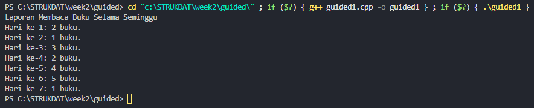
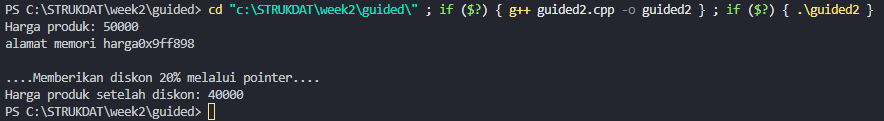
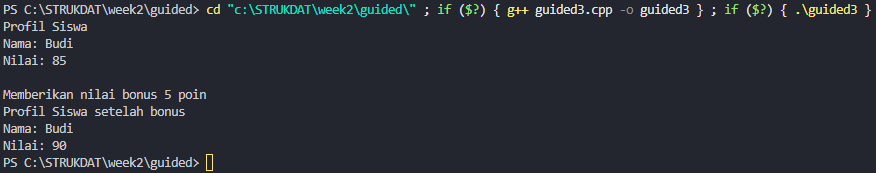
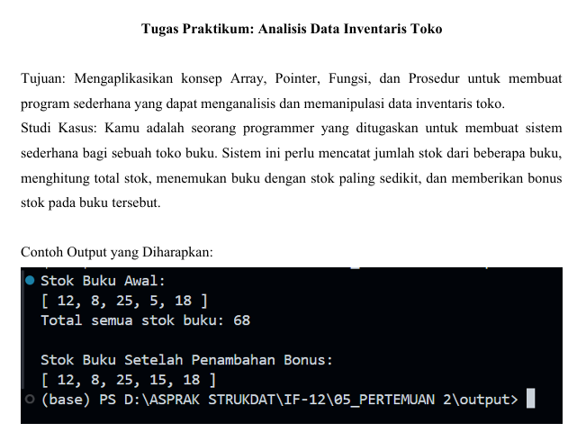

<h1 align = center > <b>  LAPORAN PRATIKUM STUKTUR DATA PERTEMUAN 2 <br>
</b></h1><p align = center><b>Nama : Muhammad Haidar Amanullah || NIM : 103112400262 || Kelas : IF-12-05</b></p>

<h1> 1. Motivasi Belajar Struktur Data </h1>

Menurut saya, belajar struktur data itu semacam pondasi utama buat ngerti cara ngatur dan pake informasi. Kalau udah paham konsep dasarnya, bikin program jadi terasa lebih gampang, lebih rapi, dan pastinya lebih efisien. Dari situ juga, kita bisa lebih siap buat nyelesaikan masalah nyata, misalnya ngolah data di aplikasi, bikin layanan digital yang enak dipakai, atau program kecil-kecilan yang bisa bantu aktivitas sehari-hari jadi lebih simpel.


<h1> 2. Dasar Teori </h1>

Dasar teori kali ini bahas tentang array di C++. Array itu bisa dibilang wadah buat nyimpen banyak data dengan tipe yang sama dalam satu variabel. Jadi kita nggak perlu bikin variabel satu-satu buat tiap nilai. Misalnya mau nyimpen lima nilai ujian, tinggal bikin int nilai[5]; udah cukup.

Setiap data di array punya indeks, semacam nomor urut biar gampang diakses. Indeksnya mulai dari 0, jadi elemen pertama itu nilai[0], elemen kedua nilai[1], dan seterusnya sampai nilai[4].

Array ada dua jenis, yaitu satu dimensi dan dua dimensi.
Kalau satu dimensi kayak deretan nilai biasa, contohnya int nilai[5] = {80, 85, 90, 95, 100};.
Kalau dua dimensi bentuknya kayak tabel atau matriks, misalnya int data[3][2] = {{80, 85}, {90, 95}, {100, 75}};.

Biar gampang ngebayangin, array itu kayak lemari, dan setiap loker di dalamnya itu satu elemen array. Nomor loker itu ibarat indeks. Jadi kalau mau ambil data tertentu, tinggal sebut aja nomor lokernya.

Kelebihan array, datanya gampang diatur dan bisa diakses cepat pakai indeks. Tapi kekurangannya, ukuran array nggak bisa diubah setelah dibuat dan semua datanya harus punya tipe yang sama.

<h1> 3. Guided </h1>

### 3.1 Guided 1 (Laporan Membaca Buku)

**-Code Program-**

```cpp
#include <iostream>
using namespace std;    

int main() {
    int bukuPerHari[7]={2,1,3,2,4,5,1}; 
    int totalBuku=0; 

    cout<<"Laporan Membaca Buku Selama Seminggu"<<endl;
    for (int i=0; i<7; i++) {
        
        cout<<"Hari ke-"<<i+1<<": "<<bukuPerHari[i]<<" buku."<<endl;
        totalBuku += bukuPerHari[i];
    }
} 

```
**-Penjelasan Umum-**

Program di atas merupakan contoh sederhana penggunaan bahasa pemrograman C++ untuk mencatat jumlah buku yang dibaca selama seminggu. Program ini menunjukkan penggunaan array untuk menyimpan data, serta perulangan (for) untuk menampilkan hasil setiap hari. Selain itu, program juga menggunakan variabel untuk menghitung total buku yang dibaca secara keseluruhan.

**-Output-**



### 3.2 Guided 2 (Harga Diskon dengan Pointer)

**-Code Program-**

```cpp
#include <iostream> 

using namespace std;    

int main(){
    float hargaProduk =50000;
    float *ptrHarga;
    ptrHarga = &hargaProduk;


    cout << "Harga produk: "<<hargaProduk<<endl;
    cout << "alamat memori harga"<<ptrHarga<<endl;

    cout << "\n....Memberikan diskon 20% melalui pointer...."<<endl;
    *ptrHarga = *ptrHarga * 0.8;
    cout << "Harga produk setelah diskon: "<<hargaProduk<<endl;
    return 0;
}
```
**-Penjelasan Umum-**

Program di atas merupakan contoh sederhana penggunaan pointer dalam bahasa pemrograman C++. Program ini memperlihatkan bagaimana pointer digunakan untuk menyimpan alamat memori dari suatu variabel dan mengubah nilainya secara tidak langsung. Pada kasus ini, pointer digunakan untuk memberikan diskon 20% pada harga produk dengan cara mengakses dan memodifikasi nilai variabel melalui alamat memorinya.


**-Output-**



### 3.3 Guided 3 (Memberikan Nilai Bonus)

**-Code Program-**

```cpp
#include <iostream>
#include <string>

using namespace std;    

float hitungRataRata(int nilaiTugas, int nilaiUTS){
    return (nilaiTugas + nilaiUTS) / 2.0f;   
}

void cetakProfil(string nama, float nilai){
    cout << "Nama: " << nama << endl;
    cout << "Nilai: " << nilai << endl;
}

void beriNilaiBonus(float &nilai){
    nilai += 5.0f; 
}

int main(){
    string namaSiswa="Budi";
    int Tugas=80, uts=90;

    float nilaiAkhir = hitungRataRata(Tugas, uts);

    cout << "Profil Siswa" << endl;
    cetakProfil(namaSiswa, nilaiAkhir);

    cout << "\nMemberikan nilai bonus 5 poin" << endl;
    beriNilaiBonus(nilaiAkhir);

    cout << "Profil Siswa setelah bonus" << endl;
    cetakProfil(namaSiswa, nilaiAkhir);

    return 0;
}
```
**-Penjelasan Umum-**

Program di atas merupakan contoh sederhana penggunaan fungsi, prosedur, dan parameter dalam bahasa pemrograman C++. Program ini menunjukkan cara membuat beberapa fungsi dengan tugas berbeda, seperti menghitung rata-rata nilai, menampilkan profil siswa, dan menambah nilai menggunakan parameter referensi. Melalui program ini, kita bisa melihat bagaimana data dikirim ke fungsi, diproses, lalu hasilnya ditampilkan kembali tanpa harus menulis kode yang sama berulang kali.


**-Output-**




<h1> 4. Unguided </h1>

### 4.1 Unguided 1

**-Soal 1-**



**-Code Program-**

```cpp
#include <iostream>

using namespace std;

void tampilkanArray(int stok[], int jumlah) {
    cout << "[ ";
    for (int i = 0; i < jumlah; i++) {
        cout << stok[i];
        if (i < jumlah - 1) cout << ", ";
    }
    cout << " ]" << endl;
}

int hitungTotal(int stok[], int jumlah) {
    int total = 0;
    for (int i = 0; i < jumlah; i++) {
        total += stok[i];
    }
    return total;
}

int* cariStokMinimum(int stok[], int jumlah) {
    int* terkecil = &stok[0];
    for (int i = 1; i < jumlah; i++) {
        if (stok[i] < *terkecil) {
            terkecil = &stok[i];
        }
    }
    return terkecil;
}

void tambahBonus(int* ptr) {
    *ptr += 10;
}

int main() {
    int stokBuku[] = {12, 8, 25, 5, 18};
    int jumlahBuku = 5;

    cout << "Stok Buku Awal:" << endl;
    tampilkanArray(stokBuku, jumlahBuku);

    int totalAwal = hitungTotal(stokBuku, jumlahBuku);
    cout << "Total semua stok buku: " << totalAwal << endl;

    int* stokTerkecil = cariStokMinimum(stokBuku, jumlahBuku);
    tambahBonus(stokTerkecil);

    cout << "\nStok Buku Setelah Penambahan Bonus:" << endl;
    tampilkanArray(stokBuku, jumlahBuku);

    return 0;
}
```
**-Penjelasan Umum-**

Program di atas merupakan contoh sederhana penggunaan bahasa pemrograman C++ untuk menganalisis dan memanipulasi data stok buku menggunakan array, fungsi, dan pointer. Program ini menampilkan stok awal, menghitung total stok buku, mencari stok paling sedikit, lalu menambah bonus stok secara otomatis melalui pointer. Program ini menunjukkan konsep dasar C++ seperti penggunaan array, perulangan, fungsi, dan manipulasi data melalui alamat memori.

**-Output-**


<h1> 5. Kesimpulan </h1>
Dari praktikum ini dapat disimpulkan bahwa tujuan praktikum telah tercapai, yaitu memahami penerapan konsep **array**, **fungsi**, **prosedur**, dan **pointer** dalam bahasa pemrograman C++. Melalui pembuatan program analisis data inventaris toko, mahasiswa dapat belajar bagaimana cara menyimpan data dalam array, menghitung total stok menggunakan fungsi, menampilkan data dengan prosedur, serta memanipulasi nilai melalui pointer. Praktikum ini membantu memperkuat pemahaman tentang cara kerja fungsi dan pointer dalam mengakses serta mengubah data secara efisien. Selain itu, kegiatan ini juga melatih logika berpikir terstruktur dalam menyelesaikan permasalahan pemrograman yang berhubungan dengan pengolahan data secara sederhana.

<h1> 6. Referensi </h1>

1. https://www.programiz.com/cpp-programming

2. https://en.cppreference.com/w/
   
3. https://www.geeksforgeeks.org/cpp/c-plus-plus/