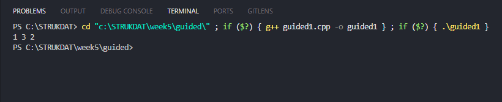
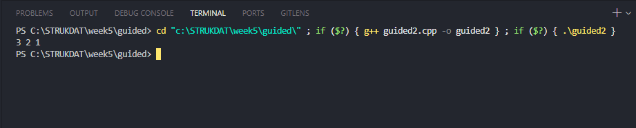
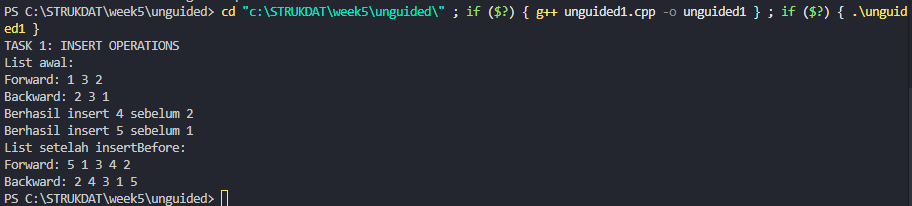
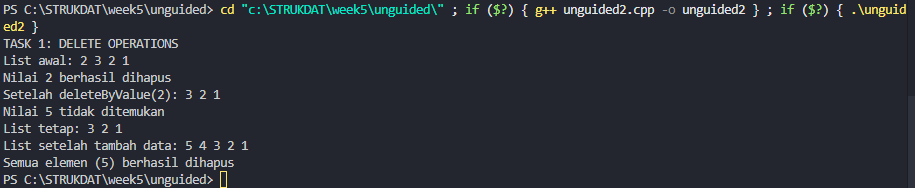
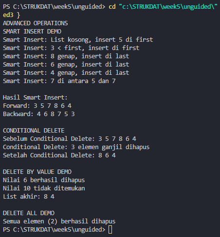

<h1 align = center > <b>  LAPORAN PRATIKUM STUKTUR DATA PERTEMUAN 1 <br>
</b></h1><p align = center><b>Nama : Muhammad Haidar Amanullah || NIM : 103112400262 || Kelas : IF-12-05</b></p>

<h1> 1. Motivasi Belajar Struktur Data </h1>

Menurut saya, belajar struktur data itu semacam pondasi utama buat ngerti cara ngatur dan pake informasi. Kalau udah paham konsep dasarnya, bikin program jadi terasa lebih gampang, lebih rapi, dan pastinya lebih efisien. Dari situ juga, kita bisa lebih siap buat nyelesaikan masalah nyata, misalnya ngolah data di aplikasi, bikin layanan digital yang enak dipakai, atau program kecil-kecilan yang bisa bantu aktivitas sehari-hari jadi lebih simpel.


<h1> 2. Dasar Teori </h1>

**Struktur data**

Struktur data merupakan cara menyimpan dan mengatur data di komputer agar dapat digunakan secara efisien. Salah satu struktur data dinamis yang sering digunakan adalah linked list. Tidak seperti array yang menyimpan elemen secara berurutan di memori, linked list terdiri dari simpul (node) yang saling terhubung melalui pointer. Setiap node memiliki dua bagian utama: data dan pointer (next) yang menunjuk ke node berikutnya.

**Singly Linked List**

Singly Linked List adalah bentuk dasar dari linked list di mana setiap node hanya memiliki satu pointer yang mengarah ke node selanjutnya. Struktur ini memudahkan penambahan dan penghapusan data secara dinamis, tetapi traversal hanya bisa dilakukan satu arah.

**Doubly Linked List**

Doubly Linked List merupakan pengembangan dari Singly Linked List. Setiap node memiliki dua pointer, yaitu next untuk node berikutnya dan prev untuk node sebelumnya. Hal ini memungkinkan traversal dilakukan dua arah (maju dan mundur), meskipun memerlukan memori lebih banyak.

Dalam implementasinya, linked list menggunakan alokasi memori dinamis agar ukurannya dapat berubah sesuai kebutuhan program. Penghapusan node harus diikuti dengan dealokasi untuk mencegah kebocoran memori.

<h1> 3. Guided </h1>

### 3.1 Guided 1 (dll-insert)

**-Code Program-**

```cpp
#include <iostream>
#define Nil NULL
using namespace std;

typedef int infotype;
typedef struct elmlist *address;

struct elmlist {
    infotype info;
    address next;
    address prev;
};

struct List {
    address first;
    address last;
};

void insertFirst(List &L, address P) {
    P->next = L.first;
    P->prev = Nil;
    if (L.first != Nil) L.first->prev = P;

    else L.last = P;
    L.first = P;
} 

void insertLast(List &L, address P) {
    P->prev = L.last;
    P->next = Nil;
    if (L.last != Nil) L.last->next = P;

    else L.first = P;
    L.last = P;
} 

void insertAfter(List &L, address P, address R) {
    P->next = R->next;
    P->prev = R;
    if (R->next != Nil) R->next->prev = P;

    else L.last = P;
    R->next = P;
}

address alokasi(infotype x) {
    address P = new elmlist;
    P->info = x;
    P->next = Nil;
    P->prev = Nil;
    return P;
}

void pritinfo(List L) {
    address P = L.first;
    while (P != Nil) {
        cout << P->info << " ";
        P = P->next;
    }
    cout << endl;
}

int main() {
    List L;
    L.first = Nil;
    L.last = Nil;

    address P1 = alokasi(1);
    insertFirst(L, P1); 
    address P2 = alokasi(2);
    insertLast(L, P2);
    address P3 = alokasi(3);
    insertAfter(L, P3, P1);

    pritinfo(L); 

    return 0;
}
```
**-Penjelasan Umum-**

Program di atas merupakan contoh penerapan struktur data Double Linked List dalam bahasa C++. Program ini menunjukkan cara membuat node secara dinamis, menghubungkan antar-node dengan pointer next dan prev, serta melakukan operasi dasar seperti penyisipan data di awal, akhir, dan setelah node tertentu. Melalui fungsi printinfo(), program menampilkan isi list secara berurutan, menggambarkan konsep dasar pengelolaan data dinamis menggunakan pointer.

**-Output-**



### 3.2 Guided 2 (dll-hapus)

**-Code Program-**

```cpp
#include <iostream>
using namespace std;
#define Nil NULL

typedef int infotype;
typedef struct elmlist *address;

struct elmlist {
    infotype info;
    address next;
    address prev;
};

struct List {
    address first;
    address last;
};

address alokasi(infotype x) {
    address P = new elmlist;
    P->info = x; P->next = Nil; P->prev = Nil; return P;
}

void dealokasi(address &P) { delete P; P = Nil; }
void insertFirst(List &L, address P) {
    P->next = L.first; P->prev = Nil;
    if (L.first != Nil) L.first->prev = P; else L.last = P;
    L.first = P;
}

void pritinfo(List L) {
    address P = L.first; while (P != Nil) { cout << P->info << " "; P = P->next; } cout << endl;
}
void deleteFirst(List &L, address &P) {
    P = L.first; L.first = L.first -> prev;
    if (L.first != Nil) L.first -> prev = Nil; else L.last = Nil;
    P -> prev = Nil; P -> next = Nil;
}

void deleteLast(List &L, address &P) {
    P = L.last; L.last = L.last -> prev;
    if (L.last != Nil) L.last -> next = Nil; else L.first = Nil;
    P -> prev = Nil; P -> next = Nil;
}

void deleteAfter(List &L, address &P, address R) {
    P = R -> next; R -> next = P -> next;
    if (P -> next != Nil) P -> next -> prev = R; else L.last = R;
    P -> prev = Nil; P -> next = Nil;
}

int main() {
    List L; L.first = Nil; L.last = Nil;
    insertFirst(L, alokasi(1)); insertFirst(L, alokasi(2)); insertFirst(L, alokasi(3));
    pritinfo(L);
    address P; deleteFirst(L, P); dealokasi(P);
    deleteAfter(L, P, L.first); dealokasi(P);
    pritinfo(L);
    return 0;
}

```
**-Penjelasan Umum-**

Program di atas merupakan contoh penerapan struktur data Double Linked List dalam bahasa C++ yang menampilkan operasi penyisipan dan penghapusan data. Program ini menggunakan pointer untuk menghubungkan antar-node dan memanfaatkan alokasi serta dealokasi memori dinamis.

Melalui fungsi seperti insertFirst(), deleteFirst(), deleteLast(), dan deleteAfter(), program memperlihatkan bagaimana elemen dapat ditambah atau dihapus dari list secara efisien. Hasilnya ditampilkan dengan fungsi printinfo(), yang menelusuri isi list dari node pertama hingga terakhir. Program ini menggambarkan konsep dasar manajemen memori dan manipulasi pointer dalam struktur data dinamis.

**-Output-**



<h1> 4. Unguided </h1>

### 4.1 Unguided 1

**-Code Program-**

```cpp
#include <iostream>
#define Nil NULL
using namespace std;

typedef int infotype;
typedef struct elmlist *address;

struct elmlist {
    infotype info;
    address next;
    address prev;
};

struct List {
    address first;
    address last;
};

address alokasi(infotype x) {
    address P = new elmlist;
    P->info = x; P->next = Nil; P->prev = Nil;
    return P;
}

void insertFirst(List &L, address P) {
    P->next = L.first; P->prev = Nil;
    if (L.first != Nil) L.first->prev = P;
    else L.last = P;
    L.first = P;
}

void insertLast(List &L, address P) {
    P->prev = L.last; P->next = Nil;
    if (L.last != Nil) L.last->next = P;
    else L.first = P;
    L.last = P;
}

void insertAfter(List &L, address P, address R) {
    if (R != Nil) {
        P->next = R->next; P->prev = R;
        if (R->next != Nil) R->next->prev = P;
        else L.last = P;
        R->next = P;
    }
}

void insertBefore(List &L, address P, address R) {
    if (R != Nil) {
        cout << "Berhasil insert " << P->info << " sebelum " << R->info << endl;
        P->next = R; P->prev = R->prev;
        if (R->prev != Nil) R->prev->next = P;
        else L.first = P;
        R->prev = P;
    }
}

void pritinfo(List L) {
    cout << "Forward: ";
    address P = L.first;
    while (P != Nil) { cout << P->info << " "; P = P->next; }
    cout << endl;
}

void printReverse(List L) {
    cout << "Backward: ";
    address P = L.last;
    while (P != Nil) { cout << P->info << " "; P = P->prev; }
    cout << endl;
}

int main() {
    List L; L.first = Nil; L.last = Nil;

    cout << "TASK 1: INSERT OPERATIONS" << endl;

    insertLast(L, alokasi(1));
    insertLast(L, alokasi(3));
    insertLast(L, alokasi(2));

    cout << "List awal:" << endl;
    pritinfo(L);
    printReverse(L);


    address P1 = alokasi(4);
    insertBefore(L, P1, L.last); 

    address P2 = alokasi(5);
    insertBefore(L, P2, L.first); 

    cout << "List setelah insertBefore:" << endl;
    pritinfo(L);
    printReverse(L);

    return 0;
}
```
**-Penjelasan Umum-**

Program di atas merupakan implementasi operasi penyisipan (insert) pada Double Linked List menggunakan bahasa C++. Fungsi insertFirst, insertLast, insertAfter, dan insertBefore digunakan untuk menambahkan elemen pada berbagai posisi dalam list. Program juga menampilkan isi list secara maju (forward) dan mundur (backward) untuk menunjukkan hasil penyisipan. Secara keseluruhan, program ini memperlihatkan cara kerja manipulasi pointer dalam struktur data Double Linked List.


**-Output-**



### 4.2 Unguided 2

**-Code Program-**

```cpp
#include <iostream>
#define Nil NULL
using namespace std;

typedef int infotype;
typedef struct elmlist *address;

struct elmlist {
    infotype info;
    address next;
    address prev;
};

struct List {
    address first;
    address last;
};

address alokasi(infotype x) {
    address P = new elmlist;
    P->info = x; P->next = Nil; P->prev = Nil;
    return P;
}

void insertFirst(List &L, address P) {
    P->next = L.first; P->prev = Nil;
    if (L.first != Nil) L.first->prev = P;
    else L.last = P;
    L.first = P;
}

void insertLast(List &L, address P) {
    P->prev = L.last; P->next = Nil;
    if (L.last != Nil) L.last->next = P;
    else L.first = P;
    L.last = P;
}

void insertAfter(List &L, address P, address R) {
    if (R != Nil) {
        P->next = R->next; P->prev = R;
        if (R->next != Nil) R->next->prev = P;
        else L.last = P;
        R->next = P;
    }
}

void insertBefore(List &L, address P, address R) {
    if (R != Nil) {
        cout << "Berhasil insert " << P->info << " sebelum " << R->info << endl;
        P->next = R; P->prev = R->prev;
        if (R->prev != Nil) R->prev->next = P;
        else L.first = P;
        R->prev = P;
    }
}

void pritinfo(List L) {
    cout << "Forward: ";
    address P = L.first;
    while (P != Nil) { cout << P->info << " "; P = P->next; }
    cout << endl;
}

void printReverse(List L) {
    cout << "Backward: ";
    address P = L.last;
    while (P != Nil) { cout << P->info << " "; P = P->prev; }
    cout << endl;
}

int main() {
    List L; L.first = Nil; L.last = Nil;

    cout << "TASK 1: INSERT OPERATIONS" << endl;

    insertLast(L, alokasi(1));
    insertLast(L, alokasi(3));
    insertLast(L, alokasi(2));

    cout << "List awal:" << endl;
    pritinfo(L);
    printReverse(L);


    address P1 = alokasi(4);
    insertBefore(L, P1, L.last); 

    address P2 = alokasi(5);
    insertBefore(L, P2, L.first); 

    cout << "List setelah insertBefore:" << endl;
    pritinfo(L);
    printReverse(L);

    return 0;
}
```
**-Penjelasan Umum-**

Program di atas merupakan implementasi operasi penghapusan pada Double Linked List menggunakan C++. Fungsi deleteByValue() digunakan untuk menghapus elemen berdasarkan nilai tertentu, sedangkan deleteAll() menghapus seluruh elemen dalam list. Program ini menunjukkan cara kerja manipulasi pointer dan memori dinamis dalam pengelolaan data pada struktur list ganda.


**-Output-**



### 4.3 Unguided 3

**-Code Program-**

```cpp
#include <iostream>
#define Nil NULL
using namespace std;

typedef int infotype;
typedef struct elmlist *address;

struct elmlist {
    infotype info;
    address next;
    address prev;
};

struct List {
    address first;
    address last;
};

address alokasi(infotype x) {
    address P = new elmlist;
    P->info = x; P->next = Nil; P->prev = Nil;
    return P;
}

void dealokasi(address &P) { delete P; P = Nil; }

void insertFirst(List &L, address P) {
    P->next = L.first; P->prev = Nil;
    if (L.first != Nil) L.first->prev = P;
    else L.last = P;
    L.first = P;
}

void insertLast(List &L, address P) {
    P->prev = L.last; P->next = Nil;
    if (L.last != Nil) L.last->next = P;
    else L.first = P;
    L.last = P;
}

void insertAfter(List &L, address P, address R) {
    if (R != Nil) {
        P->next = R->next; P->prev = R;
        if (R->next != Nil) R->next->prev = P;
        else L.last = P;
        R->next = P;
    }
}

void deleteFirst(List &L, address &P) {
    P = L.first;
    if (P != Nil) {
        L.first = P->next;
        if (L.first != Nil) L.first->prev = Nil;
        else L.last = Nil;
        P->next = Nil; P->prev = Nil;
    }
}

void deleteLast(List &L, address &P) {
    P = L.last;
    if (P != Nil) {
        L.last = P->prev;
        if (L.last != Nil) L.last->next = Nil;
        else L.first = Nil;
        P->next = Nil; P->prev = Nil;
    }
}

void deleteAfter(List &L, address &P, address R) {
    if (R != Nil && R->next != Nil) {
        P = R->next;
        R->next = P->next;
        if (P->next != Nil) P->next->prev = R;
        else L.last = R;
        P->next = Nil; P->prev = Nil;
    }
}

void pritinfo(List L) {
    address P = L.first;
    while (P != Nil) { cout << P->info << " "; P = P->next; }
    cout << endl;
}

void printReverse(List L) {
    address P = L.last;
    while (P != Nil) { cout << P->info << " "; P = P->prev; }
    cout << endl;
}

void smartInsert(List &L, infotype x) {
    address P = alokasi(x);
    if (L.first == Nil) {
        cout << "Smart Insert: List kosong, insert " << x << " di first" << endl;
        insertFirst(L, P);
    } else if (x < L.first->info) {
        cout << "Smart Insert: " << x << " < first, insert di first" << endl;
        insertFirst(L, P);
    } else if (x % 2 == 0) {
        cout << "Smart Insert: " << x << " genap, insert di last" << endl;
        insertLast(L, P);
    } else if (x == 7) {
        address Q = L.first;
        while (Q != Nil && Q->info != 5) Q = Q->next;
        if (Q != Nil) {
            cout << "Smart Insert: " << x << " di antara 5 dan 7" << endl;
            insertAfter(L, P, Q);
        } else {
            cout << "Smart Insert: kondisi khusus tidak ditemukan, insert di last" << endl;
            insertLast(L, P);
        }
    } else {
        cout << "Smart Insert: kondisi lain, insert di last" << endl;
        insertLast(L, P);
    }
}

void conditionalDelete(List &L) {
    cout << "Sebelum Conditional Delete: "; pritinfo(L);
    int count = 0; address P = L.first;
    while (P != Nil) {
        address nextP = P->next;
        if (P->info % 2 != 0) {
            if (P == L.first) { address del; deleteFirst(L, del); dealokasi(del); }
            else if (P == L.last) { address del; deleteLast(L, del); dealokasi(del); }
            else { address del; deleteAfter(L, del, P->prev); dealokasi(del); }
            count++;
        }
        P = nextP;
    }
    cout << "Conditional Delete: " << count << " elemen ganjil dihapus" << endl;
    cout << "Setelah Conditional Delete: "; pritinfo(L);
}

void deleteByValue(List &L, infotype x) {
    address P = L.first;
    while (P != Nil && P->info != x) P = P->next;
    if (P == Nil) cout << "Nilai " << x << " tidak ditemukan" << endl;
    else {
        if (P == L.first) { address del; deleteFirst(L, del); dealokasi(del); }
        else if (P == L.last) { address del; deleteLast(L, del); dealokasi(del); }
        else { address del; deleteAfter(L, del, P->prev); dealokasi(del); }
        cout << "Nilai " << x << " berhasil dihapus" << endl;
    }
}

void deleteAll(List &L) {
    int count = 0; address P;
    while (L.first != Nil) { deleteFirst(L, P); dealokasi(P); count++; }
    cout << "Semua elemen (" << count << ") berhasil dihapus" << endl;
}

int main() {
    List L; L.first = Nil; L.last = Nil;
    cout << "ADVANCED OPERATIONS" << endl;
    cout << "SMART INSERT DEMO" << endl;

    smartInsert(L, 5);
    smartInsert(L, 3);
    smartInsert(L, 8);
    smartInsert(L, 6);
    smartInsert(L, 4);
    smartInsert(L, 7);

    cout << endl << "Hasil Smart Insert:" << endl;
    cout << "Forward: "; pritinfo(L);
    cout << "Backward: "; printReverse(L);

    cout << endl << "CONDITIONAL DELETE" << endl;
    conditionalDelete(L);

    cout << endl << "DELETE BY VALUE DEMO" << endl;
    deleteByValue(L, 6);
    deleteByValue(L, 10);
    cout << "List akhir: "; pritinfo(L);

    cout << endl << "DELETE ALL DEMO" << endl;
    deleteAll(L);

    return 0;
}
```
**-Penjelasan Umum-**

Program di atas merupakan implementasi Double Linked List dalam bahasa C++ yang menampilkan operasi lanjutan seperti smartInsert dan conditionalDelete. Fungsi smartInsert menambahkan elemen berdasarkan kondisi tertentu (misalnya list kosong, nilai genap, atau posisi khusus), sedangkan conditionalDelete menghapus elemen sesuai kriteria (misalnya semua bilangan ganjil). Program ini juga menyertakan fungsi deleteByValue, deleteAll, dan penelusuran list dua arah. Secara keseluruhan, program ini memperlihatkan penerapan struktur data dinamis, logika percabangan, dan manajemen memori pada Double Linked List.

**-Output-**




<h1> 5. Kesimpulan </h1>
Dari praktikum ini dapat disimpulkan bahwa tujuan praktikum telah tercapai, yaitu memahami penerapan konsep struktur data Double Linked List dalam bahasa pemrograman C++. Melalui praktikum ini, mahasiswa mampu mengimplementasikan teori dasar seperti pembuatan node, penggunaan pointer, alokasi dan dealokasi memori dinamis, serta operasi dasar penyisipan (insert), penghapusan (delete), dan penelusuran data pada list ganda.

Selain itu, implementasi fungsi lanjutan seperti insertBefore, printReverse, deleteByValue, deleteAll, smartInsert, dan conditionalDelete memperkuat pemahaman terhadap logika pemrograman yang lebih kompleks serta pentingnya penanganan kondisi (edge cases) dalam algoritma. Praktikum ini juga menambah wawasan mengenai bagaimana konsep struktur data dinamis dapat diterapkan untuk mengelola data secara efisien dan fleksibel, sekaligus melatih kemampuan berpikir logis serta pemecahan masalah menggunakan C++.

<h1> 6. Referensi </h1>

1. https://www.geeksforgeeks.org/dsa/doubly-linked-list/

2. https://www.w3schools.com/dsa/dsa_data_linkedlists_types.php?
   

3. https://www.freecodecamp.org/news/how-linked-lists-work/?
