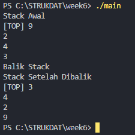
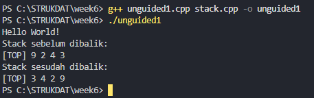
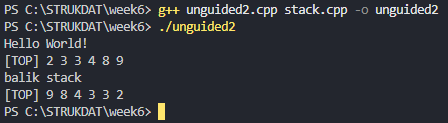
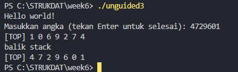

<h1 align = center > <b>  LAPORAN PRATIKUM STUKTUR DATA PERTEMUAN 6 <br>
</b></h1><p align = center><b>Nama : Muhammad Haidar Amanullah || NIM : 103112400262 || Kelas : IF-12-05</b></p>

<h1> 1. Motivasi Belajar Struktur Data </h1>

Menurut saya, belajar struktur data itu semacam pondasi utama buat ngerti cara ngatur dan pake informasi. Kalau udah paham konsep dasarnya, bikin program jadi terasa lebih gampang, lebih rapi, dan pastinya lebih efisien. Dari situ juga, kita bisa lebih siap buat nyelesaikan masalah nyata, misalnya ngolah data di aplikasi, bikin layanan digital yang enak dipakai, atau program kecil-kecilan yang bisa bantu aktivitas sehari-hari jadi lebih simpel.


<h1> 2. Dasar Teori </h1>

Struktur data merupakan cara untuk menyimpan, mengelola, dan mengorganisir data di dalam komputer agar dapat diakses dan dimanfaatkan dengan efisien. Pada praktikum kali ini, konsep yang dibahas adalah Stack (Tumpukan), yaitu salah satu bentuk Abstract Data Type (ADT) linear yang beroperasi dengan prinsip LIFO (Last In, First Out). Artinya, elemen yang terakhir dimasukkan ke dalam stack akan menjadi elemen pertama yang dikeluarkan. Konsep ini dapat dianalogikan seperti tumpukan buku atau piring — di mana elemen yang berada paling atas adalah yang pertama kali diambil.

Dalam implementasinya, stack memiliki satu ujung aktif yang disebut TOP, tempat semua operasi penambahan (Push) dan penghapusan (Pop) dilakukan. Ketika stack kosong, posisi TOP biasanya diatur ke nilai awal tertentu (misalnya -1), sedangkan saat penuh, TOP menunjukkan posisi indeks maksimum dari elemen di dalam stack.

Implementasi yang digunakan pada kode program kali ini adalah Static Array Implementation, di mana stack direpresentasikan menggunakan array berukuran tetap. Setiap elemen disimpan secara berurutan di dalam memori, dan variabel TOP digunakan untuk melacak posisi elemen terakhir. Struktur ini sederhana namun efektif untuk menggambarkan perilaku dasar stack, seperti operasi Push, Pop, dan IsEmpty/IsFull.

Selain operasi dasar, praktikum ini juga memperkenalkan penerapan stack dalam algoritma sederhana. Misalnya, pada fungsi balikStack, stack digunakan untuk membalik urutan data dengan memanfaatkan stack bantu sebagai tempat penyimpanan sementara. Hal ini menunjukkan bagaimana prinsip LIFO dapat digunakan untuk memanipulasi urutan data dengan cara yang efisien. Melalui implementasi ini, konsep dasar stack dapat dipahami secara menyeluruh — mulai dari cara kerjanya, pengelolaan data, hingga penerapannya dalam pemecahan masalah pemrograman.

<h1> 3. Guided </h1>

### 3.1 stack.h

**-Code Program-**

```cpp
#ifndef STACK_H
#define STACK_H

#define MaxEl 20
#define Nil -1

typedef int infotype;

struct Stack {
    infotype info[MaxEl]; 
    int TOP;
};

void CreateStack(Stack &S);
bool IsEmpty(Stack S);
bool IsFull(Stack S);
void Push(Stack &S, infotype X);
infotype Pop(Stack &S);
void printInfo(Stack S);

void balikStack(Stack &S); 
void pushAscending(Stack &S, infotype X);
void getInputStream(Stack &S);

#endif
```
**-Penjelasan Umum-**

Program pada file stack.h berfungsi sebagai header file yang berisi deklarasi struktur data dan fungsi yang akan digunakan dalam implementasi stack. Di dalam file ini didefinisikan sebuah konstanta MaxEl dengan nilai 20, yang menandakan kapasitas maksimum stack, serta konstanta Nil bernilai -1 yang menandakan kondisi stack kosong.

Struktur stack sendiri dideklarasikan menggunakan struct Stack, yang memiliki dua komponen utama, yaitu array info [MaxEl] sebagai tempat penyimpanan data, dan variabel TOP sebagai penunjuk posisi elemen teratas dalam stack. Selain itu, file ini juga mendeklarasikan prototipe fungsi-fungsi dasar seperti CreateStack(), IsEmpty(), IsFull(), Push(), Pop(), serta beberapa fungsi tambahan seperti printInfo(), balikStack(), pushAscending(), dan getInputStream().

Secara keseluruhan, file stack.h berfungsi sebagai kerangka utama (blueprint) dari struktur stack yang akan digunakan pada file implementasi (stack.cpp) dan file utama program (main.cpp).

### 3.2 stack.cpp

**-Code Program-**

```cpp
#include "stack.h"
#include <iostream>
using namespace std;

void CreateStack(Stack &S) {
    S.TOP = Nil; 
}

bool IsEmpty(Stack S) {
    return S.TOP == Nil;
}

bool IsFull(Stack S) {
    return S.TOP == MaxEl - 1;
}


void Push(Stack &S, infotype X) {
    if (!IsFull(S)) { 
        if (IsEmpty(S)) {
            S.TOP = 0; 
        } else {
            S.TOP++;
        }
        S.info[S.TOP] = X; 
    } else {
        cout << "Stack penuh" << endl;
    }
}

infotype Pop(Stack &S) {
    infotype X = -999; 
    if (!IsEmpty(S)) {
        X = S.info[S.TOP];
        S.TOP--;
        if (S.TOP < 0) {
            S.TOP = Nil; 
        }
    } else {
        cout << "Stack kosong" << endl;
    }
    return X;
}

void printInfo(Stack S) {
    if (IsEmpty(S)) {
        cout << "Stack kosong" << endl;
    } else {
        cout << "[TOP] ";
        for (int i = S.TOP; i >= 0; i--) {
            cout << S.info[i] << " ";
        }
        cout << endl;
    }
}

void balikStack(Stack &S) {
    if (!IsEmpty(S)) {
        Stack temp;
        CreateStack(temp);
        while (!IsEmpty(S)) {
            Push(temp, Pop(S));
        }
        S = temp;
    }
}

void pushAscending(Stack &S, infotype X) {
    if (IsFull(S)) {
        cout << "Stack penuh" << endl;
        return;
    }

    Stack temp;
    CreateStack(temp);

    while (!IsEmpty(S) && S.info[S.TOP] < X) {
        Push(temp, Pop(S));
    }

    Push(S, X);

    while (!IsEmpty(temp)) {
        Push(S, Pop(temp));
    }
}

void getInputStream(Stack &S) {
    cout << "Masukkan angka (tekan Enter untuk selesai): ";
    string input;
    cin >> input; 

    for (char c : input) {
        if (isdigit(c)) { 
            int value = c - '0';
            Push(S, value);
        }
    }
}
```
**-Penjelasan Umum-**

File stack.cpp merupakan bagian implementasi dari fungsi-fungsi yang telah dideklarasikan pada stack.h. Di dalam file ini, seluruh logika kerja dari stack diuraikan secara detail.

Fungsi CreateStack() digunakan untuk menginisialisasi stack agar siap digunakan, dengan mengatur nilai awal TOP menjadi Nil (kosong). Fungsi IsEmpty() dan IsFull() digunakan untuk memeriksa apakah stack dalam kondisi kosong atau penuh.

Operasi utama pada stack dilakukan melalui fungsi Push() dan Pop(). Fungsi Push() berfungsi untuk menambahkan elemen baru ke dalam stack selama stack belum penuh. Sebaliknya, fungsi Pop() digunakan untuk menghapus elemen paling atas dari stack dan mengembalikannya sebagai nilai keluaran. Jika stack kosong, maka akan muncul pesan “Stack kosong”.

Fungsi printInfo() digunakan untuk menampilkan isi stack dari elemen teratas (TOP) hingga terbawah. Sementara itu, fungsi tambahan seperti balikStack() digunakan untuk membalik urutan elemen stack dengan memanfaatkan stack sementara. Fungsi pushAscending() menambahkan elemen baru ke stack dengan cara menjaga urutan elemen agar tetap teratur (ascending). Terakhir, fungsi getInputStream() digunakan untuk membaca masukan angka dari pengguna, lalu menyimpannya ke dalam stack.

Melalui file stack.cpp ini, konsep dasar operasi LIFO (Last In, First Out) pada stack dapat terimplementasi secara penuh menggunakan array statis dan operasi pointer sederhana.

### 3.3 main.cpp

**-Code Program-**

```cpp
#include "stack.h"
#include <iostream>
using namespace std;

int main() {
    Stack S;
    CreateStack(S);

    
    Push(S, 3);
    Push(S, 4);
    Push(S, 8);
    Pop(S);
    Push(S, 2);
    Push(S, 3);
    Pop(S);
    Push(S, 9);

    cout << "Stack sebelum dibalik:" << endl;
    printInfo(S);

    balikStack(S);

    cout << "Stack sesudah dibalik:" << endl;
    printInfo(S);

    return 0;
}
```
**-Penjelasan Umum-**

File main.cpp merupakan bagian utama program (fungsi main) yang berfungsi untuk menguji seluruh operasi yang telah diimplementasikan dalam stack.cpp. Pada bagian ini, sebuah objek stack S dibuat dan diinisialisasi menggunakan fungsi CreateStack().

Selanjutnya dilakukan beberapa operasi dasar seperti Push() untuk menambahkan elemen dan Pop() untuk menghapus elemen dari stack. Urutan operasi yang dijalankan menunjukkan bagaimana data dimasukkan dan dihapus sesuai prinsip LIFO. Setelah beberapa kali operasi dilakukan, program menampilkan isi stack sebelum dan sesudah fungsi balikStack() dijalankan menggunakan printInfo().

Fungsi balikStack() berperan penting di sini karena membalik urutan elemen yang sudah ada, sehingga hasil output menunjukkan perbedaan urutan sebelum dan sesudah pembalikan.

Secara keseluruhan, file main.cpp berfungsi untuk mengimplementasikan dan mendemonstrasikan penggunaan seluruh fungsi stack, mulai dari pembuatan, pengisian, penghapusan, hingga manipulasi data. Program ini memperlihatkan bagaimana struktur data stack bekerja secara nyata, baik dalam hal logika penyimpanan maupun pengelolaan data berbasis array statis.

**-Output-**



<h1> 4. Unguided </h1>

### 4.1 Unguided 1

**-Code Program-**

```cpp
#include "stack.h"
#include <iostream>
using namespace std;

int main() {
    cout << "Hello World!" << endl;
    Stack S;
    CreateStack(S);

    Push(S, 3);
    Push(S, 4);
    Push(S, 8);
    Pop(S);
    Push(S, 2);
    Push(S, 3);
    Pop(S);
    Push(S, 9);

    cout << "Stack sebelum dibalik:" << endl;
    printInfo(S);

    balikStack(S);

    cout << "Stack sesudah dibalik:" << endl;
    printInfo(S);

    return 0;
}
```
**-Penjelasan Umum-**

Program pada file unguided1.cpp merupakan implementasi dasar dari struktur data Stack (Tumpukan) menggunakan bahasa C++. Program ini menampilkan operasi dasar seperti Push, Pop, dan balikStack, yang menunjukkan prinsip utama dari stack yaitu LIFO (Last In, First Out).

Pada awal program, stack S dibuat dan diinisialisasi menggunakan CreateStack(). Beberapa data kemudian dimasukkan menggunakan fungsi Push(), sementara sebagian data dikeluarkan dengan Pop(). Proses ini memperlihatkan bagaimana elemen yang terakhir dimasukkan akan menjadi elemen pertama yang dihapus.

Setelah operasi dasar dilakukan, fungsi printInfo() digunakan untuk menampilkan isi stack sebelum dibalik. Kemudian, fungsi balikStack() dijalankan untuk membalik urutan elemen dalam stack dengan bantuan stack sementara. Hasil akhirnya ditampilkan kembali, memperlihatkan perubahan posisi elemen.
Secara keseluruhan, program ini memperlihatkan mekanisme dasar stack serta cara kerja fungsi pembalik urutan data menggunakan prinsip LIFO.

**-Output-**



### 4.2 Unguided 2

**-Code Program-**

```cpp
#include "stack.h"
#include <iostream>
using namespace std;

int main() {
    cout << "Hello World!" << endl;
    Stack S;
    CreateStack(S);
    pushAscending(S, 3);
    pushAscending(S, 4);
    pushAscending(S, 8);
    pushAscending(S, 2);
    pushAscending(S, 3);
    pushAscending(S, 9);
    printInfo(S);
    cout << "balik stack" << endl;
    balikStack(S);
    printInfo(S);
    return 0;
}
```
**-Penjelasan Umum-**

Program unguided2.cpp merupakan pengembangan lanjutan dari operasi dasar stack dengan menambahkan fitur penyisipan elemen secara terurut melalui fungsi pushAscending().

Pada awal program, stack S dibuat dan diinisialisasi dengan CreateStack(). Kemudian, beberapa nilai dimasukkan ke dalam stack menggunakan fungsi pushAscending(). Fungsi ini memastikan bahwa setiap elemen yang ditambahkan akan ditempatkan pada posisi yang tepat sehingga urutan stack tetap terjaga dalam kondisi ascending (menaik). Proses ini menggunakan stack bantu (temporary stack) untuk memindahkan sementara elemen yang tidak sesuai urutan.

Setelah seluruh data dimasukkan, fungsi printInfo() menampilkan isi stack dalam urutan menaik. Kemudian, balikStack() dijalankan untuk membalik urutan elemen, menunjukkan fleksibilitas penggunaan fungsi pembalik pada stack yang sudah terurut.
Program ini menunjukkan bagaimana logika dasar stack dapat dimodifikasi untuk menyelesaikan masalah penyisipan terurut menggunakan struktur data sederhana.

**-Output-**



### 4.3 Unguided 3

**-Code Program-**

```cpp
#include "stack.h"
#include <iostream>
using namespace std;


int main()
{
    cout << "Hello world!" << endl;
    Stack S;
    CreateStack(S);
    getInputStream(S);
    printInfo(S);
    cout<<"balik stack"<<endl;
    balikStack(S);
    printInfo(S);
    return 0;
}
```
**-Penjelasan Umum-**

Program unguided3.cpp merupakan implementasi dari stack yang berfokus pada pengambilan data secara interaktif dari pengguna. Program ini menggunakan fungsi getInputStream() untuk menerima input berupa angka yang dimasukkan oleh pengguna, kemudian setiap digit angka tersebut dimasukkan ke dalam stack menggunakan operasi Push.

Setelah proses input selesai, fungsi printInfo() digunakan untuk menampilkan elemen-elemen yang telah tersimpan di dalam stack. Selanjutnya, program menjalankan fungsi balikStack() untuk membalik urutan data, sehingga urutan output menjadi kebalikan dari input awal.

Melalui implementasi ini, pengguna dapat melihat secara langsung bagaimana data yang dimasukkan ke dalam stack mengikuti prinsip LIFO, serta bagaimana fungsi pembalik bekerja untuk mengubah urutan elemen dengan bantuan stack sementara. Program unguided3.cpp memperkuat pemahaman tentang konsep dasar stack dengan menambahkan aspek interaksi pengguna dan penerapan fungsi input dinamis.

**-Output-**




<h1> 5. Kesimpulan </h1>
Dari hasil praktikum ini dapat disimpulkan bahwa tujuan utama telah tercapai, yaitu memahami konsep dasar dan penerapan struktur data Stack (Tumpukan) menggunakan bahasa pemrograman C++. Stack merupakan salah satu bentuk Abstract Data Type (ADT) yang bekerja dengan prinsip LIFO (Last In, First Out), di mana elemen terakhir yang dimasukkan akan menjadi elemen pertama yang dikeluarkan.

Melalui beberapa percobaan, mahasiswa berhasil mengimplementasikan berbagai operasi dasar seperti Push, Pop, dan PrintInfo, serta mengembangkan fungsi tambahan seperti balikStack(), pushAscending(), dan getInputStream(). Fungsi-fungsi tersebut memperlihatkan bagaimana stack dapat dimanfaatkan untuk melakukan manipulasi data seperti pembalikan urutan, penyisipan terurut, hingga pengambilan input secara interaktif.

Selain itu, praktikum ini juga memperkuat pemahaman mengenai pengelolaan data menggunakan array statis, penanganan kondisi penuh dan kosong, serta pentingnya logika kontrol dalam menjaga integritas data di dalam stack. Dengan memahami prinsip kerja dan penerapannya, struktur data stack dapat digunakan sebagai dasar dalam membangun algoritma yang efisien dan terstruktur di berbagai bidang pemrograman.

<h1> 6. Referensi </h1>

1. https://www.geeksforgeeks.org/dsa/stack-data-structure/

2. https://www.w3schools.com/cpp/cpp_data_structures.asp
   
3. Drozdek, A. (2013). Data Structures and Algorithms in C++ (4th Edition). Cengage Learning.