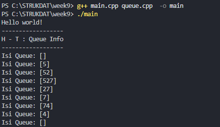
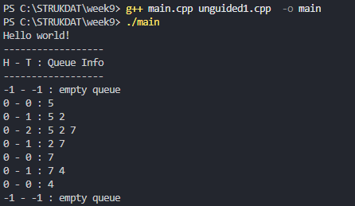
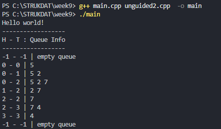
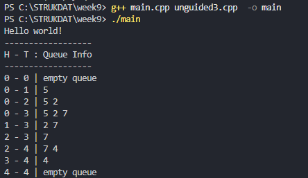

<h1 align = center > <b>  LAPORAN PRATIKUM STUKTUR DATA PERTEMUAN 8 <br>
</b></h1><p align = center><b>Nama : Muhammad Haidar Amanullah || NIM : 103112400262 || Kelas : IF-12-05</b></p>

<h1> 1. Motivasi Belajar Struktur Data </h1>

Menurut saya, belajar struktur data itu semacam pondasi utama buat ngerti cara ngatur dan pake informasi. Kalau udah paham konsep dasarnya, bikin program jadi terasa lebih gampang, lebih rapi, dan pastinya lebih efisien. Dari situ juga, kita bisa lebih siap buat nyelesaikan masalah nyata, misalnya ngolah data di aplikasi, bikin layanan digital yang enak dipakai, atau program kecil-kecilan yang bisa bantu aktivitas sehari-hari jadi lebih simpel.


<h1> 2. Dasar Teori </h1>

Struktur data merupakan teknik penyimpanan dan pengaturan data di dalam memori komputer agar proses pengolahan data dapat berlangsung secara cepat, efisien, dan terstruktur. Salah satu struktur data linier yang banyak digunakan adalah Queue atau antrian.

Queue bekerja berdasarkan prinsip FIFO (First-In, First-Out), yaitu elemen yang pertama kali masuk akan menjadi elemen pertama yang keluar. Konsep ini serupa dengan antrean di kehidupan nyata, misalnya ketika menunggu giliran di kasir: orang yang datang lebih dulu akan dilayani terlebih dahulu. Dalam struktur data ini, proses penambahan elemen dilakukan pada bagian belakang antrian (tail), sedangkan penghapusan elemen dilakukan dari bagian depan (head).

Salah satu metode dasar untuk mengimplementasikan Queue adalah dengan menggunakan array statis. Pada cara yang paling sederhana, array digunakan sebagai wadah data dengan dua variabel penunjuk, yakni head dan tail. Implementasi awal sering menempatkan head pada indeks ke-0, sehingga ketika operasi enqueue dilakukan, data baru ditaruh di bagian tail. Namun, pada operasi dequeue, elemen pada head dihapus, sehingga seluruh elemen di belakangnya harus digeser satu posisi ke kiri. Proses pergeseran inilah yang menyebabkan operasi menjadi tidak efisien karena membutuhkan banyak langkah ketika jumlah data besar.

Untuk meningkatkan efisiensi, digunakan pendekatan di mana data tidak lagi digeser. Pada metode ini, ketika dequeue dilakukan, penunjuk head cukup digeser maju tanpa memindahkan elemen di dalam array. Sayangnya, pendekatan ini menghasilkan masalah baru berupa kondisi “pseudo-full” atau penuh semu. Hal ini terjadi ketika tail telah mencapai batas akhir indeks array, padahal masih terdapat ruang kosong di bagian awal akibat head yang sudah bergeser. Ruang kosong tersebut tidak dapat digunakan kembali kecuali dilakukan reset manual.

Solusi dari kedua permasalahan tersebut adalah penggunaan Circular Queue, yaitu teknik yang memperlakukan array seperti sebuah lingkaran. Pada struktur ini, jika tail mencapai indeks terakhir array, maka posisi berikutnya akan kembali ke indeks 0, dan begitu pula sebaliknya. Perputaran ini dimungkinkan karena memanfaatkan operasi modulo (%) pada perhitungan indeks. Dengan pendekatan circular, baik operasi enqueue maupun dequeue menjadi lebih efisien, dan masalah penuh semu dapat dihindari sepenuhnya. Circular Queue juga sering digunakan dalam sistem antrian yang memerlukan pemanfaatan ruang memori yang optimal.

<h1> 3. Guided </h1>

### 3.1 queue.h

**-Code Program-**

```cpp
#ifndef QUEUE_H
#define QUEUE_H

#include <iostream>
using namespace std;

#define MAX_QUEUE 5 
typedef int infotype;

struct Queue {
    infotype info[MAX_QUEUE]; 
    int head;
    int tail;
    int count;
};

void createQueue(Queue &Q);
bool isEmptyQueue(Queue Q);
bool isFullQueue(Queue Q);
void enqueue(Queue &Q, infotype x);
infotype dequeue(Queue &Q);
void printInfo(Queue Q);

#endif
```
**-Penjelasan Umum-**

Kode queue.h dibuat untuk mendefinisikan struktur data Queue dan fungsi-fungsi dasarnya. Pada bagian awal, digunakan header guard agar file tidak dimuat dua kali. Library <iostream> disertakan untuk menampilkan output ke layar. Konstanta MAX_QUEUE bernilai 5 menunjukkan bahwa antrian hanya dapat menampung lima elemen. Tipe infotype didefinisikan sebagai int, sehingga data yang disimpan berupa bilangan integer.

Struktur Queue berisi array info untuk menyimpan elemen antrian serta tiga variabel: head sebagai posisi depan, tail sebagai posisi belakang, dan count sebagai jumlah elemen saat ini. Di bawahnya terdapat deklarasi fungsi yang diperlukan, yaitu createQueue untuk menginisialisasi antrian, isEmptyQueue untuk memeriksa apakah antrian kosong, isFullQueue untuk memeriksa apakah antrian penuh, enqueue untuk menambah data, dequeue untuk mengambil data dari depan, dan printInfo untuk menampilkan isi antrian.

### 3.2 queue.cpp

**-Code Program-**

```cpp
#include "queue.h"
#include <iostream>
using namespace std;

void createQueue(Queue &Q) {
    Q.head = 0;
    Q.tail = 0;
    Q.count = 0; 
}

bool isEmpty(Queue Q) {
    return Q.count == 0; 
}

bool isFull(Queue Q) {
    return Q.count == MAX_QUEUE; 
}

void enqueue(Queue &Q, int x) {
    if (!isFull(Q)) {
        Q.info[Q.tail] = x; 
        Q.tail = (Q.tail + 1) % MAX_QUEUE; 
        Q.count++; 
    } else {
        cout << "Antrean Penuh!" << endl; 
    }
}

int dequeue(Queue &Q) {
    if (!isEmpty(Q)) {
        int x = Q.info[Q.head]; 
        Q.head = (Q.head + 1) % MAX_QUEUE; 
        Q.count--; 
        return x; 
    } else {
        cout << "Antrean Kosong!" << endl; 
        return -1; 
    }
}

void printInfo(Queue Q) {
    cout << "Isi Queue: [";
    if(!isEmpty (Q)){
        int i = Q.head; 
        int n = 0; 
        while (n < Q.count) { 
            cout << Q.info[i]; 
            i = (i + 1) % MAX_QUEUE; 
            n++; 
    }
}
    cout << "]" << endl;
}
```
**-Penjelasan Umum-**
Kode ini merupakan implementasi dari struktur data Circular Queue. Fungsi createQueue digunakan untuk mengatur nilai awal head, tail, dan count sehingga antrian berada dalam kondisi kosong. Fungsi isEmpty dan isFull berfungsi untuk memeriksa apakah antrian sedang kosong atau sudah penuh berdasarkan nilai count. Pada fungsi enqueue, data baru dimasukkan ke indeks tail, lalu indeks tersebut digeser secara melingkar menggunakan operasi modulo agar posisi tetap berada dalam rentang ukuran array. Nilai count juga ditambah untuk mencatat jumlah elemen yang masuk. Fungsi dequeue mengambil data dari indeks head dan memajukan indeks tersebut secara melingkar, kemudian mengurangi nilai count. Jika antrian kosong atau penuh, masing-masing fungsi akan menampilkan pesan kesalahan. Terakhir, fungsi printInfo mencetak seluruh isi antrian dengan membaca elemen mulai dari posisi head sejumlah count elemen, sehingga susunan data dalam queue dapat terlihat dengan benar.
### 3.3 main.cpp

**-Code Program-**

```cpp
#include <iostream>
#include "queue.h"
using namespace std;

int main() {
    cout << "Hello world!" << endl; 
    
    Queue Q;
    
    cout << "------------------" << endl;
    cout << "H - T : Queue Info" << endl; 
    cout << "------------------" << endl;

    createQueue(Q); 
    printInfo(Q); 

    enqueue(Q, 5); 
    printInfo(Q);  

    enqueue(Q, 2); 
    printInfo(Q);  

    enqueue(Q, 7); 
    printInfo(Q);  

    dequeue(Q); 
    printInfo(Q); 

    dequeue(Q); 
    printInfo(Q); 

    enqueue(Q, 4); 
    printInfo(Q);  

    dequeue(Q); 
    printInfo(Q); 

    dequeue(Q); 
    printInfo(Q); 

    return 0; 
}
```
**-Penjelasan Umum-**

Kode program di atas merupakan fungsi utama (main) yang digunakan untuk melakukan pengujian terhadap operasi-operasi pada struktur data Circular Queue. Program diawali dengan menampilkan pesan “Hello world!” sebagai output awal. Setelah itu, sebuah variabel Q bertipe Queue dibuat sebagai objek antrian yang akan digunakan pada seluruh proses. Program kemudian menampilkan judul informasi queue sebagai header tampilan di layar.

Selanjutnya, fungsi createQueue(Q) dipanggil untuk menginisialisasi antrian agar berada dalam kondisi kosong. Setiap kali terjadi perubahan pada antrian, program memanggil printInfo(Q) untuk menampilkan isi queue saat ini. Program kemudian menambahkan

**-Output-**



<h1> 4. Unguided </h1>

### 4.1 Unguided 1

**-Code Program-**

```cpp
#include <iostream>
#include "queue.h"

void createQueue(Queue &Q) {
    Q.head = -1;
    Q.tail = -1;
}

bool isEmptyQueue(Queue Q) {
    return Q.tail == -1;
}

bool isFullQueue(Queue Q) {
    return Q.tail == MAX_QUEUE - 1;
}

void enqueue(Queue &Q, infotype x) {
    if (isFullQueue(Q)) {
        cout << "Antrean Penuh!" << endl;
    } else {
        if (isEmptyQueue(Q)) {
            Q.head = 0; 
        }
        Q.tail++;
        Q.info[Q.tail] = x;
    }
}

infotype dequeue(Queue &Q) {
    if (isEmptyQueue(Q)) {
        cout << "Antrean Kosong!" << endl;
        return -1;
    } else {
        infotype x = Q.info[Q.head];
        for (int i = Q.head; i < Q.tail; i++) {
            Q.info[i] = Q.info[i + 1];
        }
        Q.tail--;
        if (Q.tail == -1) { 
            Q.head = -1;    
        }
        return x; 
    }
}

void printInfo(Queue Q) {
    cout << Q.head << " - " << Q.tail << " : "; 
    if (isEmptyQueue(Q)) {
        cout << "empty queue" << endl; 
    } else {
        for (int i = Q.head; i <= Q.tail; i++) {
            cout << Q.info[i];
            if (i < Q.tail) {
                cout << " ";
            }
        }
        cout << endl;
    }
}
```
**-Penjelasan Umum-**

Kode di atas merupakan implementasi Queue menggunakan array statis dengan metode antrian sederhana (linear queue), di mana operasi dequeue dilakukan dengan cara menggeser elemen. Fungsi createQueue digunakan untuk menginisialisasi antrian dengan mengatur nilai head dan tail menjadi -1, yang menandakan bahwa antrian masih kosong. Fungsi isEmptyQueue memeriksa kondisi kosong dengan mengecek apakah nilai tail bernilai -1, sedangkan isFullQueue mengecek apakah antrian sudah penuh dengan membandingkan nilai tail terhadap indeks maksimum array.

Pada fungsi enqueue, program pertama-tama memeriksa apakah antrian penuh. Jika tidak penuh dan antrian dalam keadaan kosong, maka head diatur ke 0 sebagai posisi awal data. Setelah itu, nilai tail dinaikkan satu langkah untuk menentukan posisi penyimpanan data baru, kemudian elemen x disimpan pada indeks tersebut. Sebaliknya, fungsi dequeue digunakan untuk menghapus elemen dari bagian depan antrian. Data pada indeks head disimpan terlebih dahulu sebagai nilai yang akan dikembalikan. Setelah itu, seluruh elemen di belakang head digeser satu posisi ke kiri untuk mengisi kekosongan akibat penghapusan. Nilai tail kemudian dikurangi satu. Jika setelah proses penghapusan nilai tail menjadi -1, maka head juga dikembalikan menjadi -1 untuk menandakan bahwa antrian kembali kosong.

Fungsi terakhir, yaitu printInfo, digunakan untuk menampilkan kondisi antrian. Fungsi ini menampilkan posisi head dan tail, lalu mencetak seluruh elemen queue mulai dari indeks head hingga tail. Jika antrian dalam keadaan kosong, program menampilkan pesan "empty queue". Dengan cara ini, setiap perubahan pada queue dapat diamati secara jelas selama program dijalankan.

**-Output-**



### 4.2 Unguided 2

**-Code Program-**

```cpp
#include <iostream>
#include "queue.h"

void createQueue(Queue &Q) {
    Q.head = -1;
    Q.tail = -1;
}

bool isEmptyQueue(Queue Q) {
    return Q.tail == -1 || Q.head > Q.tail;
}

bool isFullQueue(Queue Q) {
    return Q.tail == MAX_QUEUE - 1;
}

void enqueue(Queue &Q, infotype x) {
    if (isFullQueue(Q)) {
        cout << "Antrean Penuh (Penuh Semu)!" << endl;
    } else {
        if (isEmptyQueue(Q)) {
            Q.head = 0; 
        }
        Q.tail++;
        Q.info[Q.tail] = x;
    }
}

infotype dequeue(Queue &Q) {
    if (isEmptyQueue(Q)) {
        cout << "Antrean Kosong!" << endl;
        return -1;
    } else {
        infotype x = Q.info[Q.head];
        
        Q.head++; 
        
        if (Q.head > Q.tail) { 
            Q.head = -1;       
            Q.tail = -1;
        }
        return x;
    }
}

void printInfo(Queue Q) {
    cout << Q.head << " - " << Q.tail << " | ";
    if (isEmptyQueue(Q)) {
        cout << "empty queue" << endl;
    } else {
        for (int i = Q.head; i <= Q.tail; i++) {
            cout << Q.info[i] << " ";
        }
        cout << endl;
    }
}
```
**-Penjelasan Umum-**

Kode ini merupakan implementasi Linear Queue menggunakan array yang masih memiliki kelemahan penuh semu (pseudo-full). Fungsi createQueue mengatur nilai head dan tail menjadi -1 sebagai tanda bahwa antrian kosong. Fungsi isEmptyQueue mengecek apakah antrian kosong dengan melihat apakah tail bernilai -1 atau ketika head sudah melewati tail setelah beberapa kali dequeue. Sementara itu, isFullQueue mengecek apakah tail sudah mencapai indeks maksimum array, meskipun sebenarnya ruang di depan belum tentu terpakai kembali.

Pada fungsi enqueue, nilai akan dimasukkan ke posisi tail, dan jika antrian sebelumnya kosong, head diatur ke 0 terlebih dahulu. Jika antrian penuh, program hanya menampilkan pesan bahwa antrian mengalami kondisi penuh semu. Untuk dequeue, data diambil dari indeks head, kemudian head digeser satu posisi ke depan. Jika setelah digeser posisi head melewati tail, maka antrian kembali dianggap kosong dan kedua indeks di-reset ke -1. Fungsi printInfo hanya menampilkan posisi head–tail dan isi elemen dari head hingga tail.

Secara keseluruhan, kode ini menunjukkan bagaimana Linear Queue bekerja sekaligus memperlihatkan masalah ruang kosong yang tidak dapat digunakan kembali.

**-Output-**



### 4.3 Unguided 3

**-Code Program-**

```cpp
#include <iostream>
#include "queue.h"

void createQueue(Queue &Q) {
    Q.head = 0;
    Q.tail = 0;
}

bool isEmptyQueue(Queue Q) {
    return Q.head == Q.tail;
}

bool isFullQueue(Queue Q) {
    return (Q.tail + 1) % MAX_QUEUE == Q.head;
}

void enqueue(Queue &Q, infotype x) {
    if (isFullQueue(Q)) {
        cout << "Antrean Penuh!" << endl;
    } else {
        Q.info[Q.tail] = x;
        Q.tail = (Q.tail + 1) % MAX_QUEUE;
    }
}

infotype dequeue(Queue &Q) {
    if (isEmptyQueue(Q)) {
        cout << "Antrean Kosong!" << endl;
        return -1;
    } else {
        infotype x = Q.info[Q.head];
        Q.head = (Q.head + 1) % MAX_QUEUE; 
        return x;
    }
}

void printInfo(Queue Q) {
    cout << Q.head << " - " << Q.tail << " | "; 
    if (isEmptyQueue(Q)) {
        cout << "empty queue" << endl;
    } else {
        int i = Q.head;
        while (i != Q.tail) {
            cout << Q.info[i] << " ";
            i = (i + 1) % MAX_QUEUE; 
        }
        cout << endl;
    }
}
```
**-Penjelasan Umum-**

Kode ini merupakan implementasi Circular Queue menggunakan array, di mana indeks head dan tail bergerak secara melingkar menggunakan operasi modulo. Fungsi createQueue menginisialisasi queue dengan menyamakan nilai head dan tail di posisi 0. Fungsi isEmptyQueue mengecek apakah queue kosong dengan memeriksa apakah head sama dengan tail, sedangkan isFullQueue mendeteksi kondisi penuh dengan melihat apakah posisi tail berikutnya akan bertabrakan dengan head.

Pada fungsi enqueue, data baru dimasukkan pada indeks tail, lalu tail digeser maju secara melingkar menggunakan (tail + 1) % MAX_QUEUE. Jika queue penuh, program menampilkan pesan bahwa antrean penuh. Fungsi dequeue mengambil data dari indeks head dan kemudian memajukan head juga menggunakan operasi modulo. Jika kosong, fungsi menampilkan pesan dan mengembalikan -1.

Fungsi printInfo menampilkan isi queue dengan cara mencetak elemen dari indeks head hingga tail, bergerak melingkar sampai posisi keduanya sama. Implementasi ini menyelesaikan masalah penuh semu yang ada pada linear queue, karena ruang yang kosong di awal array dapat digunakan kembali.

**-Output-**




<h1> 5. Kesimpulan </h1>
Pada praktikum ini, implementasi struktur data Queue berhasil dilakukan dengan memanfaatkan prinsip FIFO (First In First Out). Program yang dibuat mampu menjalankan operasi dasar seperti createQueue untuk inisialisasi antrian, enqueue untuk menambahkan data, dequeue untuk menghapus data dari depan antrian, serta printInfo untuk menampilkan kondisi antrian terbaru.

Melalui serangkaian percobaan pada program, terlihat bahwa setiap perubahan pada queue—baik penambahan maupun penghapusan elemen—dapat diproses dengan benar sesuai urutan yang diharapkan. Hal ini menunjukkan pentingnya pengelolaan pointer head dan tail agar struktur antrian tetap konsisten.

Secara keseluruhan, praktikum ini memberikan pemahaman yang lebih mendalam mengenai cara kerja queue dalam pengolahan data berurutan, serta bagaimana struktur ini dapat diterapkan pada berbagai sistem seperti layanan pelanggan, manajemen tugas, dan pemrosesan data secara bertahap.

<h1> 6. Referensi </h1>

1. https://www.tutorialspoint.com/cplusplus/cpp_queue_library.htm

2. https://www.geeksforgeeks.org/dsa/queue-data-structure/
   

3. DSiregar, R. (2019). Struktur Data Menggunakan C++. Andi Publisher.
